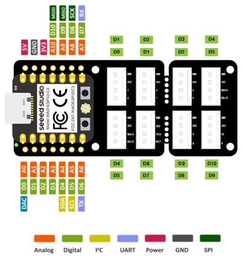
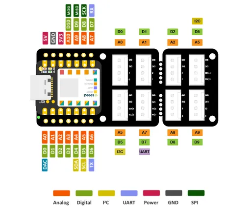
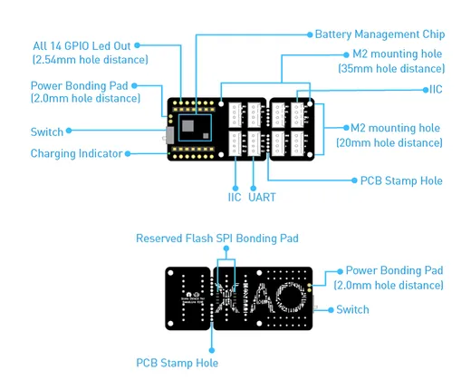

# Grove Shield for XIAO

**Seeed Studio** · Expansion

Revision: Not identified  
Coverage: Pinout image collected

[Browse all manufacturers](../../../../BROWSE.md) · [Desktop app](https://github.com/valleytechsolutions/black-wire-desktop)

## Pinout (XIAO ESP32C3)

**pinout image** · Reviewed source · PNG

[Open original reference](../../../../library/media/dd8d56eb2a29c427d3fffe0614db4d6786d7ccbc7253ef0aef9c343e1796043a.png)

**Credit and rights:** Not established; source attribution retained. Source/manufacturer: Seeed Studio.

[Source 1](https://files.seeedstudio.com/wiki/ESPHome/50.png) · [Source 2](https://wiki.seeedstudio.com/Connect-Grove-to-Home-Assistant-ESPHome/)

Imported from existing Seeed Studio Board Reference; original working path preserved.

SHA-256: `dd8d56eb2a29c427d3fffe0614db4d6786d7ccbc7253ef0aef9c343e1796043a`

## Pinout

**pinout image** · Reviewed source · PNG

[Open original reference](../../../../library/media/32932e35556f8d69a71012fae9d4d51605479340408988814bfd522009ed659e.png)

**Credit and rights:** Not established; source attribution retained. Source/manufacturer: Seeed Studio.

[Source 1](https://files.seeedstudio.com/wiki/Grove-Shield-for-Seeeduino-XIAO/img/pinout.png) · [Source 2](https://wiki.seeedstudio.com/Grove-Shield-for-Seeeduino-XIAO-embedded-battery-management-chip/)

Imported from existing Seeed Studio Board Reference; original working path preserved.

SHA-256: `32932e35556f8d69a71012fae9d4d51605479340408988814bfd522009ed659e`

## Hardware Overview

**source reference** · Unreviewed source · PNG

[Open original reference](../../../../library/media/4a792ac0cfe68d36005fb3f6a3e81df3a7792ebc36059e6616af3e586f4489d5.png)

**Credit and rights:** Source rights not yet established. Source/manufacturer: Seeed Studio.

[Source 1](https://files.seeedstudio.com/wiki/Grove-Shield-for-Seeeduino-XIAO/img/hardware-overview.png) · [Source 2](https://wiki.seeedstudio.com/Grove-Shield-for-Seeeduino-XIAO-embedded-battery-management-chip/)

Original source index: Hardware Overview. This file is searchable but has not been promoted to a reviewed physical board pinout.

SHA-256: `4a792ac0cfe68d36005fb3f6a3e81df3a7792ebc36059e6616af3e586f4489d5`

Pin assignments have not been independently electrically verified. Check board revision before wiring.
