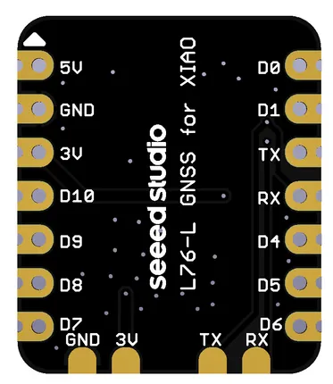

# L76-L GNSS Module for XIAO

**Seeed Studio** · Expansion

Revision: Not identified  
Coverage: Partial pinout collected; full reference still needed

[Browse all manufacturers](../../../../BROWSE.md) · [Desktop app](https://github.com/valleytechsolutions/black-wire-desktop)

## Pinout (Back)

**pinout image** · Reviewed source · PNG

[Open original reference](../../../../library/media/6e83db6dd9d70e9ccaf199a5db29b35f70eed982c5beb5f8dc2a38887ac3c8c8.png)

**Credit and rights:** Not established; source attribution retained. Source/manufacturer: Seeed Studio.

[Source 1](https://raw.githubusercontent.com/Longan-Labs/XIAO_GPS/main/IMG/back.png) · [Source 2](https://wiki.seeedstudio.com/gnss_for_xiao/)

Imported from existing Seeed Studio Board Reference; original working path preserved. Only the named connector or subsection is covered.

**Partial diagram. Confirm missing pins against the exact board documentation.**

SHA-256: `6e83db6dd9d70e9ccaf199a5db29b35f70eed982c5beb5f8dc2a38887ac3c8c8`

Pin assignments have not been independently electrically verified. Check board revision before wiring.
