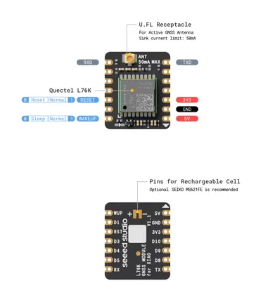

# L76K GNSS Module for XIAO

**Seeed Studio** · Expansion

Revision: Not identified  
Coverage: Partial pinout collected; full reference still needed

[Browse all manufacturers](../../../../BROWSE.md) · [Desktop app](https://github.com/valleytechsolutions/black-wire-desktop)

## Pinout

**pinout image** · Reviewed source · PNG

[Open original reference](../../../../library/media/9fc8cd70a85811fcf8acc518ad43b6e58bb81fd8c883d6a6fd5343a485e1cc07.png)

**Credit and rights:** Not established; source attribution retained. Source/manufacturer: Seeed Studio.

[Source 1](https://files.seeedstudio.com/wiki/Seeeduino-XIAO-Expansion-Board/GPS_Module/L76K/L76K_GNSS_Module_for_XIAO_Pinout_V1.1.png) · [Source 2](https://wiki.seeedstudio.com/get_start_l76k_gnss/)

Imported from existing Seeed Studio Board Reference; original working path preserved. Only the named connector or subsection is covered.

**Partial diagram. Confirm missing pins against the exact board documentation.**

SHA-256: `9fc8cd70a85811fcf8acc518ad43b6e58bb81fd8c883d6a6fd5343a485e1cc07`

Pin assignments have not been independently electrically verified. Check board revision before wiring.
