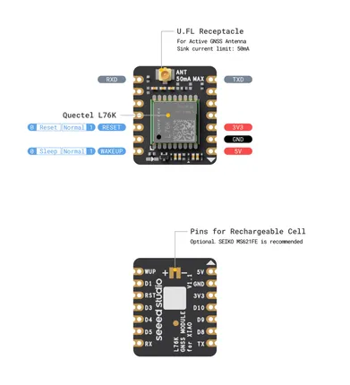

# L76K GNSS Module for XIAO

**Seeed Studio** · Expansion

Revision: Not identified

Coverage: Partial connector source collected; full-device review pending

[Browse all manufacturers](../../../../BROWSE.md) · [Devices & IoT](../../../../DEVICES.md) · [Open in the browser guide](https://valleytech-black-wire-guide.pages.dev/?board=seeed-studio-expansion-l76k-gnss-module-for-xiao)

## Datasheets and original documentation

Board datasheet: **not yet recorded**. Visual reference: **available**.

[Manufacturer source (recorded link)](https://wiki.seeedstudio.com/get_start_l76k_gnss/)

A chip datasheet, schematic and board datasheet have different scopes. Match the exact hardware revision.

[Documentation coverage and remaining gaps](../../../../DOCUMENTATION.md)

## Pinout

**pinout image** · Connector diagram visually inspected; independent electrical review pending · PNG

[Open original reference](../../../../library/media/9fc8cd70a85811fcf8acc518ad43b6e58bb81fd8c883d6a6fd5343a485e1cc07.png)

**Credit and rights:** Not established; source attribution retained. Source/manufacturer: Seeed Studio.

[Source 1](https://files.seeedstudio.com/wiki/Seeeduino-XIAO-Expansion-Board/GPS_Module/L76K/L76K_GNSS_Module_for_XIAO_Pinout_V1.1.png) · [Source 2](https://wiki.seeedstudio.com/get_start_l76k_gnss/)

Physical connector/pad source reference. Only the connections shown are covered; source conflicts and exact revision still require technical review.

Image revision: Not identified

SHA-256: `9fc8cd70a85811fcf8acc518ad43b6e58bb81fd8c883d6a6fd5343a485e1cc07`

Pin assignments have not been independently electrically verified. Check board revision before wiring.
