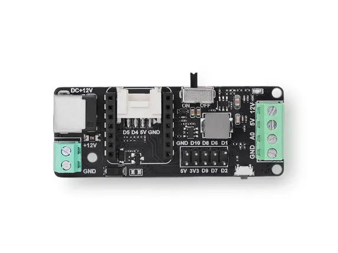
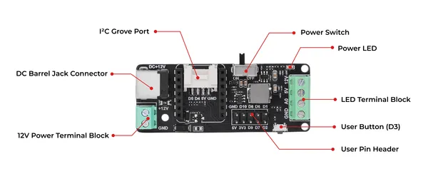

# LED Driver Board for XIAO

**Seeed Studio** · Expansion

Revision: Not identified

Coverage: Board labels only; pinout needed

[Browse all manufacturers](../../../../BROWSE.md) · [Devices & IoT](../../../../DEVICES.md) · [Open in the browser guide](https://valleytech-black-wire-guide.pages.dev/?board=seeed-studio-expansion-led-driver-board-for-xiao)

## Datasheets and original documentation

Board datasheet: **not yet recorded**. Visual reference: **available**.

[Manufacturer source (recorded link)](https://wiki.seeedstudio.com/led_driver_board/)

A chip datasheet, schematic and board datasheet have different scopes. Match the exact hardware revision.

[Documentation coverage and remaining gaps](../../../../DOCUMENTATION.md)

## Pinout

**board labeling image** · Reviewed source · JPG

[Open original reference](../../../../library/media/ffe6a89aab5b196aac552d72fc24b7585ebd45522bbdf66560611ad62420d711.jpg)

**Credit and rights:** Not established; source attribution retained. Source/manufacturer: Seeed Studio.

[Source 1](https://files.seeedstudio.com/wiki/LED_Driver_Board_for_XIAO/dimension.jpg) · [Source 2](https://wiki.seeedstudio.com/led_driver_board/)

Imported from existing Seeed Studio Board Reference; original working path preserved.

Image revision: Not identified

SHA-256: `ffe6a89aab5b196aac552d72fc24b7585ebd45522bbdf66560611ad62420d711`

## Hardware Overview

**source reference** · Unreviewed source · PNG

[Open original reference](../../../../library/media/faccd1a664bf4437a8d4084ddcfbc5e8e2bd636ae8f3c7e4df689579fe7976ea.png)

**Credit and rights:** Source rights not yet established. Source/manufacturer: Seeed Studio.

[Source 1](https://files.seeedstudio.com/wiki/LED_Driver_Board_for_XIAO/hardware_overview.png) · [Source 2](https://wiki.seeedstudio.com/led_driver_board/)

Original source index: Hardware Overview. This file is searchable but has not been promoted to a reviewed physical board pinout.

Image revision: Not identified

SHA-256: `faccd1a664bf4437a8d4084ddcfbc5e8e2bd636ae8f3c7e4df689579fe7976ea`

Pin assignments have not been independently electrically verified. Check board revision before wiring.
