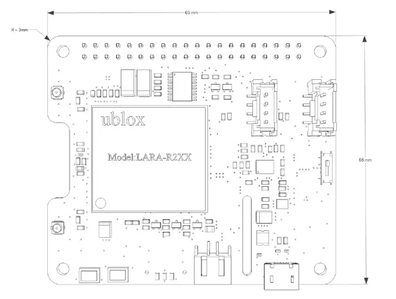
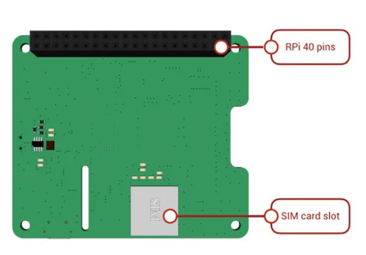
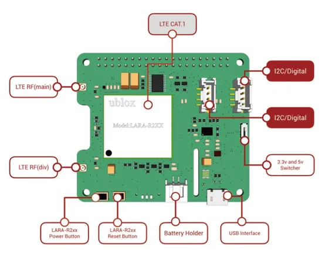

# LTE Cat 1 Pi HAT

**Seeed Studio** · Expansion

Revision: Not identified  
Coverage: Board labels only; pinout needed

[Browse all manufacturers](../../../../BROWSE.md) · [Desktop app](https://github.com/valleytechsolutions/black-wire-desktop)

## Pinout

**board labeling image** · Reviewed source · JPG

[Open original reference](../../../../library/media/60b951b23b11de46f476066fb30cbe649660d99e9976ce0445cf83dd7902c4dc.jpg)

**Credit and rights:** Not established; source attribution retained. Source/manufacturer: Seeed Studio.

[Source 1](https://files.seeedstudio.com/wiki/LTE_Cat_1_Pi_HAT/Img/pinout.jpg) · [Source 2](https://wiki.seeedstudio.com/LTE_Cat_1_Pi_HAT/)

Imported from existing Seeed Studio Board Reference; original working path preserved.

SHA-256: `60b951b23b11de46f476066fb30cbe649660d99e9976ce0445cf83dd7902c4dc`

## Dimensions

**source reference** · Unreviewed source · PNG

[Open original reference](../../../../library/media/b0d5bf249b71f09fb2e90a62f2eeede60f5f2b15b60955a58f62129eda1c8c36.png)

**Credit and rights:** Source rights not yet established. Source/manufacturer: Seeed Studio.

[Source 1](https://files.seeedstudio.com/wiki/LTE_Cat_1_Pi_HAT/Img/Hard01.png) · [Source 2](https://wiki.seeedstudio.com/LTE_Cat_1_Pi_HAT/)

Original source index: Dimensions. This file is searchable but has not been promoted to a reviewed physical board pinout.

SHA-256: `b0d5bf249b71f09fb2e90a62f2eeede60f5f2b15b60955a58f62129eda1c8c36`

## Hardware Overview (Back)

**source reference** · Unreviewed source · PNG

[Open original reference](../../../../library/media/e69c6eeb5d7df432b09d96b4fab4ff2aa27cfd1e6e764deaecffff254b3e8cc9.png)

**Credit and rights:** Source rights not yet established. Source/manufacturer: Seeed Studio.

[Source 1](https://files.seeedstudio.com/wiki/LTE_Cat_1_Pi_HAT/Img/interfaces2.png) · [Source 2](https://wiki.seeedstudio.com/LTE_Cat_1_Pi_HAT/)

Original source index: Hardware Overview (Back). This file is searchable but has not been promoted to a reviewed physical board pinout.

SHA-256: `e69c6eeb5d7df432b09d96b4fab4ff2aa27cfd1e6e764deaecffff254b3e8cc9`

## Hardware Overview (Front)

**source reference** · Unreviewed source · PNG

[Open original reference](../../../../library/media/d945de6ca9a8393fe75d3f4a7a1b3796c886ccb9822d15cc83425f6de519bdc2.png)

**Credit and rights:** Source rights not yet established. Source/manufacturer: Seeed Studio.

[Source 1](https://files.seeedstudio.com/wiki/LTE_Cat_1_Pi_HAT/Img/interfaces1.png) · [Source 2](https://wiki.seeedstudio.com/LTE_Cat_1_Pi_HAT/)

Original source index: Hardware Overview (Front). This file is searchable but has not been promoted to a reviewed physical board pinout.

SHA-256: `d945de6ca9a8393fe75d3f4a7a1b3796c886ccb9822d15cc83425f6de519bdc2`

Pin assignments have not been independently electrically verified. Check board revision before wiring.
