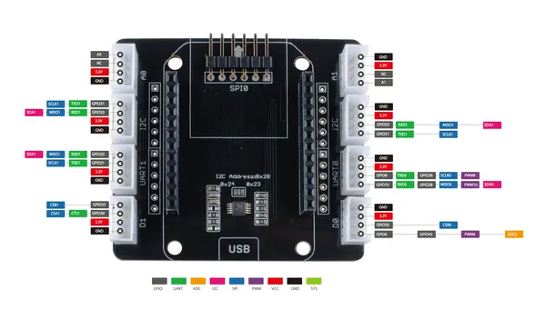
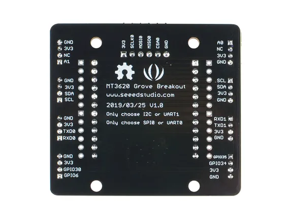
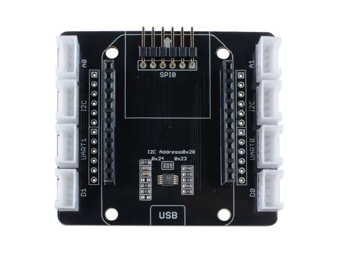
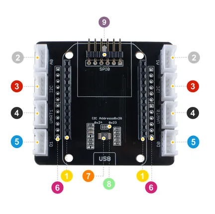

# MT3620 Grove Breakout

**Seeed Studio** · Expansion

Revision: Not identified  
Coverage: Pinout image collected

[Browse all manufacturers](../../../../BROWSE.md) · [Desktop app](https://github.com/valleytechsolutions/black-wire-desktop)

## Pinout

**pinout image** · Reviewed source · PNG

[Open original reference](../../../../library/media/17ab6d5a8f63d22a76067f8e06599d3146ffa16afe0816be5760b7a2ad6dfbf1.png)

**Credit and rights:** Not established; source attribution retained. Source/manufacturer: Seeed Studio.

[Source 1](https://files.seeedstudio.com/wiki/MT3620_Grove_Breakout/img/pinmap2.png) · [Source 2](https://wiki.seeedstudio.com/MT3620_Grove_Breakout/)

Imported from existing Seeed Studio Board Reference; original working path preserved.

SHA-256: `17ab6d5a8f63d22a76067f8e06599d3146ffa16afe0816be5760b7a2ad6dfbf1`

## Pinout (Back)

**board labeling image** · Reviewed source · JPG

[Open original reference](../../../../library/media/a73c3840d65ce9ccd482ade2e62cabbc3ce5b52175582dcbb1a02186b23fe3a4.jpg)

**Credit and rights:** Not established; source attribution retained. Source/manufacturer: Seeed Studio.

[Source 1](https://files.seeedstudio.com/wiki/MT3620_Grove_Breakout/img/MT3620-Grove-Breakout-back.jpg) · [Source 2](https://wiki.seeedstudio.com/MT3620_Grove_Breakout/)

Imported from existing Seeed Studio Board Reference; original working path preserved.

SHA-256: `a73c3840d65ce9ccd482ade2e62cabbc3ce5b52175582dcbb1a02186b23fe3a4`

## Hardware Overview (Front)

**source reference** · Unreviewed source · JPG

[Open original reference](../../../../library/media/d56184aac5c68f2e76f647fae3785a13a86891fc49d94b0a24a34ae827ad31a6.jpg)

**Credit and rights:** Source rights not yet established. Source/manufacturer: Seeed Studio.

[Source 1](https://files.seeedstudio.com/wiki/MT3620_Grove_Breakout/img/MT3620-Grove-Breakout-front.jpg) · [Source 2](https://wiki.seeedstudio.com/MT3620_Grove_Breakout/)

Original source index: Hardware Overview (Front). This file is searchable but has not been promoted to a reviewed physical board pinout.

SHA-256: `d56184aac5c68f2e76f647fae3785a13a86891fc49d94b0a24a34ae827ad31a6`

## Hardware Overview

**source reference** · Unreviewed source · PNG

[Open original reference](../../../../library/media/720398648c58ecb75790cb3d1975448bd97f3a8c09435a203e3400593387c612.png)

**Credit and rights:** Source rights not yet established. Source/manufacturer: Seeed Studio.

[Source 1](https://files.seeedstudio.com/wiki/MT3620_Grove_Breakout/img/103100123_hardware_overview.png) · [Source 2](https://wiki.seeedstudio.com/MT3620_Grove_Breakout/)

Original source index: Hardware Overview. This file is searchable but has not been promoted to a reviewed physical board pinout.

SHA-256: `720398648c58ecb75790cb3d1975448bd97f3a8c09435a203e3400593387c612`

Pin assignments have not been independently electrically verified. Check board revision before wiring.
