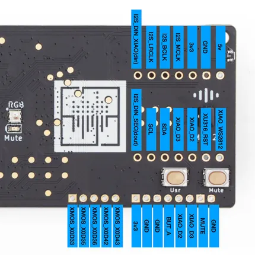
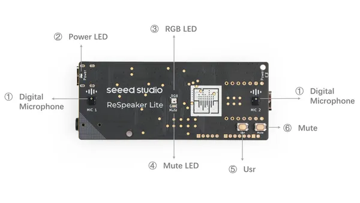
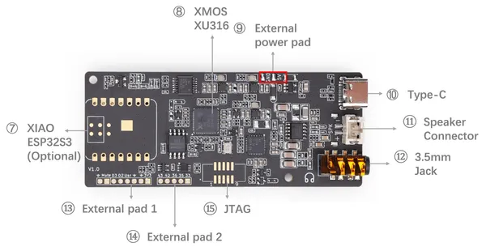
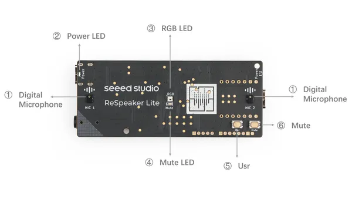

# reSpeaker Lite

**Seeed Studio** · Expansion

Revision: Not identified  
Coverage: Pinout image collected

[Browse all manufacturers](../../../../BROWSE.md) · [Desktop app](https://github.com/valleytechsolutions/black-wire-desktop)

## Pinout

**pinout image** · Reviewed source · PNG

[Open original reference](../../../../library/media/e870fcf94eeb62567f1a9c9c06538329cf75bd12dc29d95bef8408a016aa67f8.png)

**Credit and rights:** Not established; source attribution retained. Source/manufacturer: Seeed Studio.

[Source 1](https://github.com/respeaker/ReSpeaker_Lite/raw/master/doc/images/pinout.png) · [Source 2](https://wiki.seeedstudio.com/reSpeaker_usb_v3/)

Imported from existing Seeed Studio Board Reference; original working path preserved.

SHA-256: `e870fcf94eeb62567f1a9c9c06538329cf75bd12dc29d95bef8408a016aa67f8`

## Hardware Overview (Back)

**source reference** · Unreviewed source · PNG

[Open original reference](../../../../library/media/0a8824b02706f753e4bbe5cc94c5ce6a0ddf8cbaa19fb9753e12ed75b02c4e77.png)

**Credit and rights:** Source rights not yet established. Source/manufacturer: Seeed Studio.

[Source 1](https://files.seeedstudio.com/wiki/SenseCAP/respeaker/back.png) · [Source 2](https://wiki.seeedstudio.com/xiao_respeaker/)

Original source index: Hardware Overview (Back). This file is searchable but has not been promoted to a reviewed physical board pinout.

SHA-256: `0a8824b02706f753e4bbe5cc94c5ce6a0ddf8cbaa19fb9753e12ed75b02c4e77`

## Hardware Overview (Front)

**source reference** · Unreviewed source · PNG

[Open original reference](../../../../library/media/1dfa2ded86ac644ff99a2474fc253b905343eab6be3a33870d358a7e1a0e43a8.png)

**Credit and rights:** Source rights not yet established. Source/manufacturer: Seeed Studio.

[Source 1](https://files.seeedstudio.com/wiki/SenseCAP/respeaker/front.png) · [Source 2](https://wiki.seeedstudio.com/xiao_respeaker/)

Original source index: Hardware Overview (Front). This file is searchable but has not been promoted to a reviewed physical board pinout.

SHA-256: `1dfa2ded86ac644ff99a2474fc253b905343eab6be3a33870d358a7e1a0e43a8`

## Hardware Overview 2

**source reference** · Unreviewed source · PNG

[Open original reference](../../../../library/media/47490d01bb078aae0af6b0c061b0b2069f0f9dc2c9f31e1d5a481eb5e090d964.png)

**Credit and rights:** Source rights not yet established. Source/manufacturer: Seeed Studio.

[Source 1](https://media-cdn.seeedstudio.com/media/wysiwyg/upload/image-10.png) · [Source 2](https://wiki.seeedstudio.com/reSpeaker_usb_v3/)

Original source index: Hardware Overview 2. This file is searchable but has not been promoted to a reviewed physical board pinout.

SHA-256: `47490d01bb078aae0af6b0c061b0b2069f0f9dc2c9f31e1d5a481eb5e090d964`

## Hardware Overview

**source reference** · Unreviewed source · PNG

[Open original reference](../../../../library/media/b6b62c35d148dfc3a0541d2cfc59052bc29fc141936680d88b568bbff0db44cc.png)

**Credit and rights:** Source rights not yet established. Source/manufacturer: Seeed Studio.

[Source 1](https://media-cdn.seeedstudio.com/media/wysiwyg/upload/image-9.png) · [Source 2](https://wiki.seeedstudio.com/reSpeaker_usb_v3/)

Original source index: Hardware Overview. This file is searchable but has not been promoted to a reviewed physical board pinout.

SHA-256: `b6b62c35d148dfc3a0541d2cfc59052bc29fc141936680d88b568bbff0db44cc`

Pin assignments have not been independently electrically verified. Check board revision before wiring.
