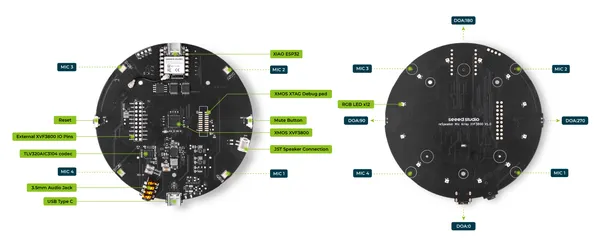

# reSpeaker XVF3800 USB 4-Mic Array

**Seeed Studio** · Expansion

Revision: Not identified  
Coverage: Pinout image collected

[Browse all manufacturers](../../../../BROWSE.md) · [Desktop app](https://github.com/valleytechsolutions/black-wire-desktop)

## Pinout

**pinout image** · Reviewed source · JPG

[Open original reference](../../../../library/media/4fc0169086ad6cb9715473df13d84986f65f0d931166109c23609a32f1c51f75.jpg)

**Credit and rights:** Not established; source attribution retained. Source/manufacturer: Seeed Studio.

[Source 1](https://files.seeedstudio.com/wiki/respeaker_xvf3800_usb/pinout.jpg) · [Source 2](https://wiki.seeedstudio.com/respeaker_xvf3800_introduction/)

Imported from existing Seeed Studio Board Reference; original working path preserved.

SHA-256: `4fc0169086ad6cb9715473df13d84986f65f0d931166109c23609a32f1c51f75`

## Hardware Overview

**source reference** · Unreviewed source · JPG

[Open original reference](../../../../library/media/61486498cd13062484cfed2b6e8bcc3ea60d826043e7df6468b862c35048770b.jpg)

**Credit and rights:** Source rights not yet established. Source/manufacturer: Seeed Studio.

[Source 1](https://files.seeedstudio.com/wiki/respeaker_xvf3800_usb/no-xiao-xvf.jpg) · [Source 2](https://wiki.seeedstudio.com/respeaker_xvf3800_introduction/)

Original source index: Hardware Overview. This file is searchable but has not been promoted to a reviewed physical board pinout.

SHA-256: `61486498cd13062484cfed2b6e8bcc3ea60d826043e7df6468b862c35048770b`

Pin assignments have not been independently electrically verified. Check board revision before wiring.
