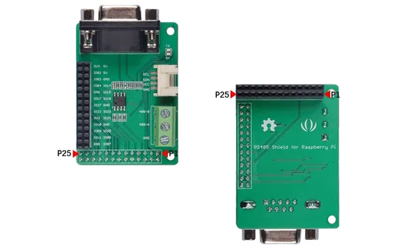
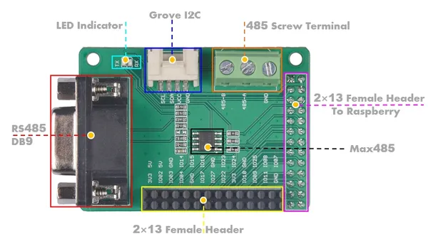

# RS-485 Shield for Raspberry Pi

**Seeed Studio** · Expansion

Revision: Not identified  
Coverage: Board labels only; pinout needed

[Browse all manufacturers](../../../../BROWSE.md) · [Desktop app](https://github.com/valleytechsolutions/black-wire-desktop)

## Pinout

**board labeling image** · Reviewed source · JPG

[Open original reference](../../../../library/media/67609d9c81d1e0b8f8c2c06654a03cf97bc4ae50fb78ddb1680f5a7d3d37ec9b.jpg)

**Credit and rights:** Not established; source attribution retained. Source/manufacturer: Seeed Studio.

[Source 1](https://files.seeedstudio.com/wiki/RS-485_Shield_for_Raspberry_Pi/img/Pin_map_2.jpg) · [Source 2](https://wiki.seeedstudio.com/RS-485_Shield_for_Raspberry_Pi/)

Imported from existing Seeed Studio Board Reference; original working path preserved.

SHA-256: `67609d9c81d1e0b8f8c2c06654a03cf97bc4ae50fb78ddb1680f5a7d3d37ec9b`

## Hardware Overview

**source reference** · Unreviewed source · JPG

[Open original reference](../../../../library/media/0d35f24b200e54a0554ae062fcd942a5805bce1ac427c9b1706e2b67ad8b9f95.jpg)

**Credit and rights:** Source rights not yet established. Source/manufacturer: Seeed Studio.

[Source 1](https://files.seeedstudio.com/wiki/RS-485_Shield_for_Raspberry_Pi/img/Pin_map.jpg) · [Source 2](https://wiki.seeedstudio.com/RS-485_Shield_for_Raspberry_Pi/)

Original source index: Hardware Overview. This file is searchable but has not been promoted to a reviewed physical board pinout.

SHA-256: `0d35f24b200e54a0554ae062fcd942a5805bce1ac427c9b1706e2b67ad8b9f95`

Pin assignments have not been independently electrically verified. Check board revision before wiring.
