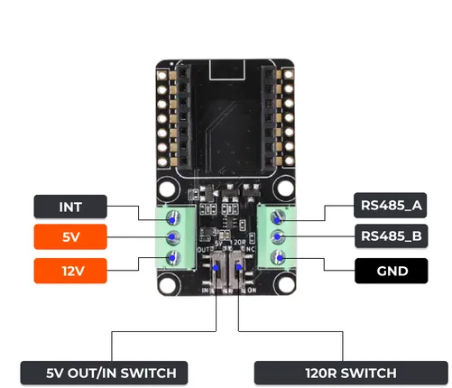

# RS485 Expansion Board for XIAO

**Seeed Studio** · Expansion

Revision: Not identified

Coverage: Partial pinout collected; full reference still needed

[Browse all manufacturers](../../../../BROWSE.md) · [Devices & IoT](../../../../DEVICES.md) · [Open in the browser guide](https://valleytech-black-wire-guide.pages.dev/?board=seeed-studio-expansion-rs485-expansion-board-for-xiao)

## Datasheets and original documentation

Board datasheet: **not yet recorded**. Visual reference: **available**.

[Manufacturer source (recorded link)](https://wiki.seeedstudio.com/XIAO-RS485-Expansion-Board/)

A chip datasheet, schematic and board datasheet have different scopes. Match the exact hardware revision.

[Documentation coverage and remaining gaps](../../../../DOCUMENTATION.md)

## Pinout

**pinout image** · Reviewed source · PNG

[Open original reference](../../../../library/media/88e71425a3ef079f2cdbe69f9db31e3df7f6fb237a570bd3d8264a027dfa2cd3.png)

**Credit and rights:** Not established; source attribution retained. Source/manufacturer: Seeed Studio.

[Source 1](https://files.seeedstudio.com/wiki/rs485_ExpansionBoard/pinlist.png) · [Source 2](https://wiki.seeedstudio.com/XIAO-RS485-Expansion-Board/)

Imported from existing Seeed Studio Board Reference; original working path preserved. Only the named connector or subsection is covered.

Image revision: Not identified

SHA-256: `88e71425a3ef079f2cdbe69f9db31e3df7f6fb237a570bd3d8264a027dfa2cd3`

Pin assignments have not been independently electrically verified. Check board revision before wiring.
