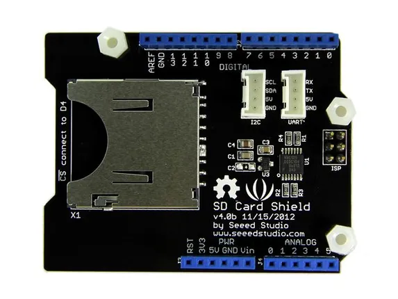

# SD Card Shield

**Seeed Studio** · Expansion

Revision: Not identified  
Coverage: Board labels only; pinout needed

[Browse all manufacturers](../../../../BROWSE.md) · [Desktop app](https://github.com/valleytechsolutions/black-wire-desktop)

## Pinout

**board labeling image** · Reviewed source · JPG

[Open original reference](../../../../library/media/02b9e54659f964e3ac5303232b43e4c49e1c7e2b5545ba3af12f13b371e159ca.jpg)

**Credit and rights:** Not established; source attribution retained. Source/manufacturer: Seeed Studio.

[Source 1](https://files.seeedstudio.com/wiki/SD_Card_Shield/img/Sdcardshield_01.jpg) · [Source 2](https://wiki.seeedstudio.com/SD_Card_Shield/)

Imported from existing Seeed Studio Board Reference; original working path preserved.

SHA-256: `02b9e54659f964e3ac5303232b43e4c49e1c7e2b5545ba3af12f13b371e159ca`

Pin assignments have not been independently electrically verified. Check board revision before wiring.
