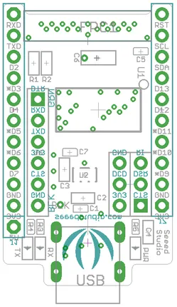
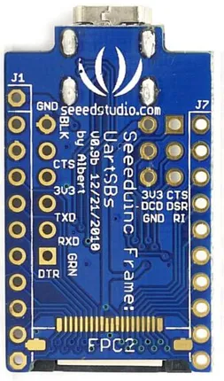
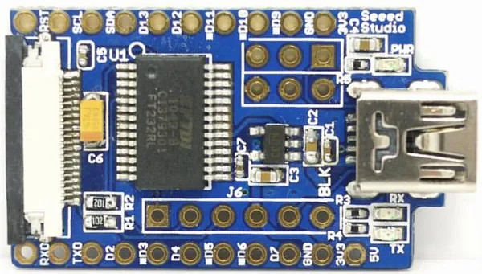

# UartSB Frame

**Seeed Studio** · Expansion

Revision: Not identified  
Coverage: Pinout image collected

[Browse all manufacturers](../../../../BROWSE.md) · [Desktop app](https://github.com/valleytechsolutions/black-wire-desktop)

## Pinout

**pinout image** · Reviewed source · PNG

[Open original reference](../../../../library/media/95615f7b56a80e668ff95385270c3751e82a260afce9adb65ec055e8d8efefae.png)

**Credit and rights:** Not established; source attribution retained. Source/manufacturer: Seeed Studio.

[Source 1](https://files.seeedstudio.com/wiki/UartSB_Frame/img/UartSB_Frame_Outline_35mmx20mm.png) · [Source 2](https://wiki.seeedstudio.com/UartSB_Frame/)

Imported from existing Seeed Studio Board Reference; original working path preserved.

SHA-256: `95615f7b56a80e668ff95385270c3751e82a260afce9adb65ec055e8d8efefae`

## Pinout (Back)

**board labeling image** · Reviewed source · JPG

[Open original reference](../../../../library/media/cda0172381164ae1f657332b0c77bb28acc64e5e418835c767121ebe354cf177.jpg)

**Credit and rights:** Not established; source attribution retained. Source/manufacturer: Seeed Studio.

[Source 1](https://files.seeedstudio.com/wiki/UartSB_Frame/img/Seeeduino_Frame_UarSBs_Bottom.jpg) · [Source 2](https://wiki.seeedstudio.com/UartSB_Frame/)

Imported from existing Seeed Studio Board Reference; original working path preserved.

SHA-256: `cda0172381164ae1f657332b0c77bb28acc64e5e418835c767121ebe354cf177`

## Pinout (Top)

**board labeling image** · Reviewed source · JPG

[Open original reference](../../../../library/media/300a0fae34d788a9e61f69c0acdea67cd1e43f9692e0717d36a30db9ff534651.jpg)

**Credit and rights:** Not established; source attribution retained. Source/manufacturer: Seeed Studio.

[Source 1](https://files.seeedstudio.com/wiki/UartSB_Frame/img/Seeeduino_Frame_UarSBs_Top.jpg) · [Source 2](https://wiki.seeedstudio.com/UartSB_Frame/)

Imported from existing Seeed Studio Board Reference; original working path preserved.

SHA-256: `300a0fae34d788a9e61f69c0acdea67cd1e43f9692e0717d36a30db9ff534651`

Pin assignments have not been independently electrically verified. Check board revision before wiring.
