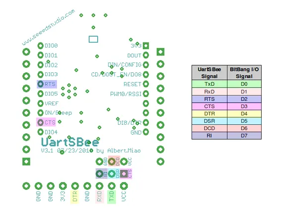

# UartSBee V4

**Seeed Studio** · Expansion

Revision: Not identified  
Coverage: Pinout image collected

[Browse all manufacturers](../../../../BROWSE.md) · [Desktop app](https://github.com/valleytechsolutions/black-wire-desktop)

## Pinout (Back)

**pinout image** · Reviewed source · PNG

[Open original reference](../../../../library/media/8fdcdaf2f00cb3bd3aabe95d4f24ded08673e335daa561774f08de85640cb66d.png)

**Credit and rights:** Not established; source attribution retained. Source/manufacturer: Seeed Studio.

[Source 1](https://files.seeedstudio.com/wiki/UartSBee_V3.1/img/UartSBee_Bottom_Bit_Bang.png) · [Source 2](https://wiki.seeedstudio.com/UartSBee_V3.1/)

Imported from existing Seeed Studio Board Reference; original working path preserved.

SHA-256: `8fdcdaf2f00cb3bd3aabe95d4f24ded08673e335daa561774f08de85640cb66d`

Pin assignments have not been independently electrically verified. Check board revision before wiring.
