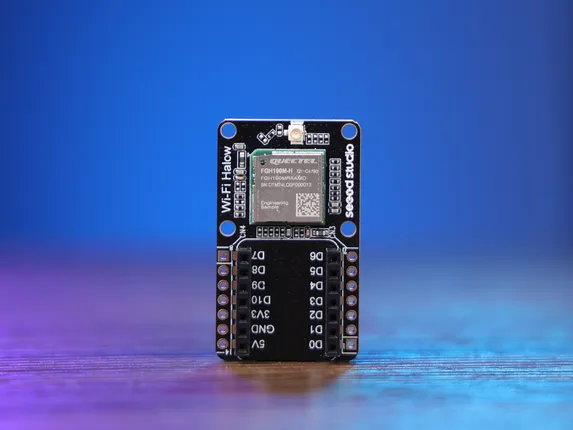

# Wi-Fi HaLow Module for XIAO

**Seeed Studio** · Expansion

Revision: Not identified  
Coverage: Board labels only; pinout needed

[Browse all manufacturers](../../../../BROWSE.md) · [Desktop app](https://github.com/valleytechsolutions/black-wire-desktop)

## Pinout

**board labeling image** · Reviewed source · JPG

[Open original reference](../../../../library/media/57e1ff9086539630deff510eab53766ca188055478086c808bceed32079804ab.jpg)

**Credit and rights:** Not established; source attribution retained. Source/manufacturer: Seeed Studio.

[Source 1](https://files.seeedstudio.com/wiki/wifi_halow/pic/20.jpg) · [Source 2](https://wiki.seeedstudio.com/getting_started_with_wifi_halow_module_for_xiao/)

Imported from existing Seeed Studio Board Reference; original working path preserved.

SHA-256: `57e1ff9086539630deff510eab53766ca188055478086c808bceed32079804ab`

Pin assignments have not been independently electrically verified. Check board revision before wiring.
