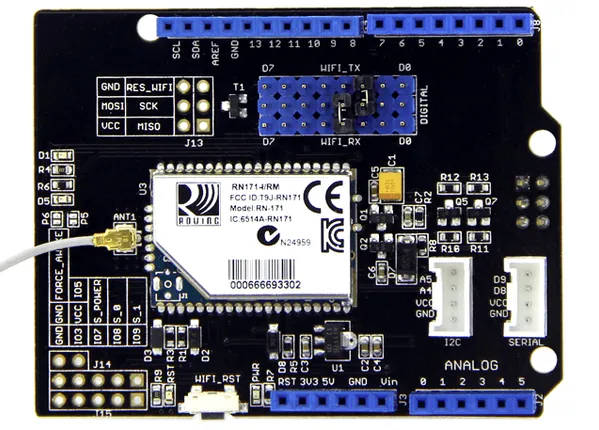
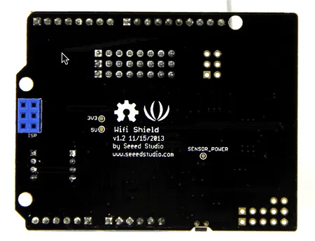
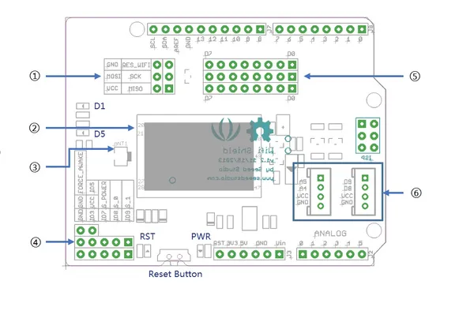
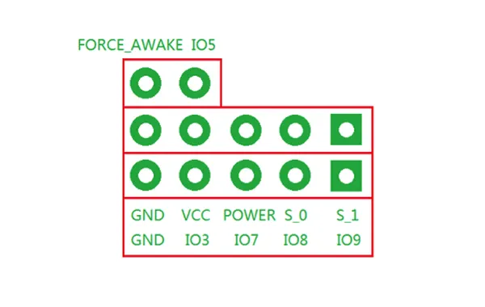

# Wifi Shield V1.2

**Seeed Studio** · Expansion

Revision: Not identified  
Coverage: Partial pinout collected; full reference still needed

[Browse all manufacturers](../../../../BROWSE.md) · [Desktop app](https://github.com/valleytechsolutions/black-wire-desktop)

## Pinout

**pinout image** · Reviewed source · PNG

[Open original reference](../../../../library/media/2e0488f098fb989697474caa82b63e4fde6043ab544328cfea74d0ab72cdfad9.png)

**Credit and rights:** Not established; source attribution retained. Source/manufacturer: Seeed Studio.

[Source 1](https://files.seeedstudio.com/wiki/Wifi_shield_v1.2/img/Wifi_shield_v1.1_pinout.png) · [Source 2](https://wiki.seeedstudio.com/Wifi_Shield_V1.2/)

Imported from existing Seeed Studio Board Reference; original working path preserved. Only the named connector or subsection is covered.

**Partial diagram. Confirm missing pins against the exact board documentation.**

SHA-256: `2e0488f098fb989697474caa82b63e4fde6043ab544328cfea74d0ab72cdfad9`

## Pinout (Front)

**board labeling image** · Reviewed source · PNG

[Open original reference](../../../../library/media/6bfcd74c21ddc66c334ee8506a9411a8411e44cfc8089af726b6c546b76dc894.png)

**Credit and rights:** Not established; source attribution retained. Source/manufacturer: Seeed Studio.

[Source 1](https://files.seeedstudio.com/wiki/Wifi_shield_v1.2/img/Wifi_shield_v1.1_front.png) · [Source 2](https://wiki.seeedstudio.com/Wifi_Shield_V1.2/)

Imported from existing Seeed Studio Board Reference; original working path preserved.

SHA-256: `6bfcd74c21ddc66c334ee8506a9411a8411e44cfc8089af726b6c546b76dc894`

## Hardware Overview (Back)

**source reference** · Unreviewed source · PNG

[Open original reference](../../../../library/media/236fe2f0482b259b45cb721160411065c5180fd4422921de25503bc357e40a08.png)

**Credit and rights:** Source rights not yet established. Source/manufacturer: Seeed Studio.

[Source 1](https://files.seeedstudio.com/wiki/Wifi_shield_v1.2/img/Wifi_shield_v1.1_back.png) · [Source 2](https://wiki.seeedstudio.com/Wifi_Shield_V1.2/)

Original source index: Hardware Overview (Back). This file is searchable but has not been promoted to a reviewed physical board pinout.

SHA-256: `236fe2f0482b259b45cb721160411065c5180fd4422921de25503bc357e40a08`

## Hardware Overview (Front)

**source reference** · Unreviewed source · PNG

[Open original reference](../../../../library/media/b8ef78942d5ef860d2c66e774a31aa36b6fc706ba7fd485ec00e612174392137.png)

**Credit and rights:** Source rights not yet established. Source/manufacturer: Seeed Studio.

[Source 1](https://files.seeedstudio.com/wiki/Wifi_shield_v1.2/img/Wifi_shield_v1.2_block1.png) · [Source 2](https://wiki.seeedstudio.com/Wifi_Shield_V1.2/)

Original source index: Hardware Overview (Front). This file is searchable but has not been promoted to a reviewed physical board pinout.

SHA-256: `b8ef78942d5ef860d2c66e774a31aa36b6fc706ba7fd485ec00e612174392137`

## Pin Definition Table

**source reference** · Unreviewed source · PNG

[Open original reference](../../../../library/media/fe35496b20f86dae1e22e0d818561bda03ad89ae2ca01778cfa179b1e6cf29a5.png)

**Credit and rights:** Source rights not yet established. Source/manufacturer: Seeed Studio.

[Source 1](https://files.seeedstudio.com/wiki/Wifi_shield_v1.2/img/Wifi_shield_v1.2_breakout.png) · [Source 2](https://wiki.seeedstudio.com/Wifi_Shield_V1.2/)

Original source index: Pin Definition Table. This file is searchable but has not been promoted to a reviewed physical board pinout.

SHA-256: `fe35496b20f86dae1e22e0d818561bda03ad89ae2ca01778cfa179b1e6cf29a5`

Pin assignments have not been independently electrically verified. Check board revision before wiring.
