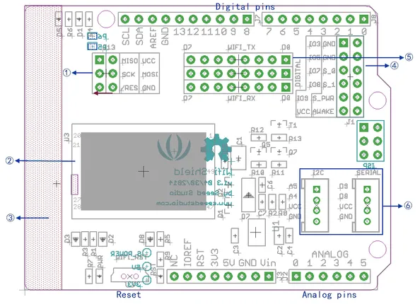
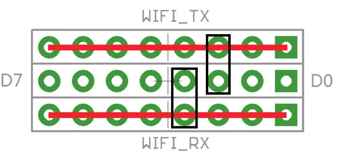

# Wifi Shield V2.0

**Seeed Studio** · Expansion

Revision: Not identified

Coverage: Pinout image collected

[Browse all manufacturers](../../../../BROWSE.md) · [Devices & IoT](../../../../DEVICES.md) · [Open in the browser guide](https://valleytech-black-wire-guide.pages.dev/?board=seeed-studio-expansion-wifi-shield-v2-0)

## Datasheets and original documentation

Board datasheet: **not yet recorded**. Visual reference: **available**.

[Manufacturer source (recorded link)](https://wiki.seeedstudio.com/Wifi_Shield_V2.0/)

A chip datasheet, schematic and board datasheet have different scopes. Match the exact hardware revision.

[Documentation coverage and remaining gaps](../../../../DOCUMENTATION.md)

## Pinout

**pinout image** · Reviewed source · PNG

[Open original reference](../../../../library/media/5129dbf1b8025cd56676d0442c1b0dfb3e2a548759ce8f2519eac0b5ada0c958.png)

**Credit and rights:** Not established; source attribution retained. Source/manufacturer: Seeed Studio.

[Source 1](https://files.seeedstudio.com/wiki/Wifi_Shield_V2.0/img/Wifi_shield_v2_breakout.png) · [Source 2](https://wiki.seeedstudio.com/Wifi_Shield_V2.0/)

Imported from existing Seeed Studio Board Reference; original working path preserved.

Image revision: Not identified

SHA-256: `5129dbf1b8025cd56676d0442c1b0dfb3e2a548759ce8f2519eac0b5ada0c958`

## Pin Functions

**source reference** · Unreviewed source · PNG

[Open original reference](../../../../library/media/a31db8da33d5aaac519889f8576bdf8c40314e09467ae262d10e3bb613592511.png)

**Credit and rights:** Source rights not yet established. Source/manufacturer: Seeed Studio.

[Source 1](https://files.seeedstudio.com/wiki/Wifi_Shield_V2.0/img/Wifi_shield_v1.1_pinout.png) · [Source 2](https://wiki.seeedstudio.com/Wifi_Shield_V2.0/)

Original source index: Pin Functions. This file is searchable but has not been promoted to a reviewed physical board pinout.

Image revision: Not identified

SHA-256: `a31db8da33d5aaac519889f8576bdf8c40314e09467ae262d10e3bb613592511`

Pin assignments have not been independently electrically verified. Check board revision before wiring.
