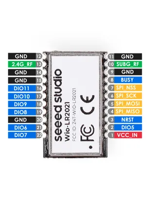
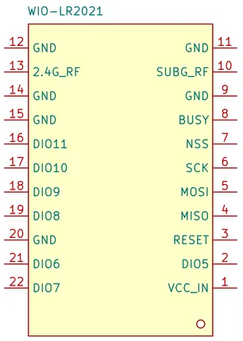

# Wio-LR2021

**Seeed Studio** · Expansion

Revision: Not identified  
Coverage: Pinout image collected

[Browse all manufacturers](../../../../BROWSE.md) · [Desktop app](https://github.com/valleytechsolutions/black-wire-desktop)

## Pinout

**pinout image** · Reviewed source · JPG

[Open original reference](../../../../library/media/63ac27467f9c9f8e9286f7a0056ee75f26892d92a0d06b02690aa3f763273215.jpg)

**Credit and rights:** Not established; source attribution retained. Source/manufacturer: Seeed Studio.

[Source 1](https://files.seeedstudio.com/wiki/Wio-LR2021/img/Wio-LR2021-pinout-5-mask.jpg) · [Source 2](https://wiki.seeedstudio.com/wio_lr2021_introduction/)

Imported from existing Seeed Studio Board Reference; original working path preserved.

SHA-256: `63ac27467f9c9f8e9286f7a0056ee75f26892d92a0d06b02690aa3f763273215`

## Pinout (Symbol)

**source reference** · Unreviewed source · PNG

[Open original reference](../../../../library/media/c4d148a83fb5af5e86c9b15a1f8b5acfa53f206def1a10677b683c34dbe4d02b.png)

**Credit and rights:** Source rights not yet established. Source/manufacturer: Seeed Studio.

[Source 1](https://files.seeedstudio.com/wiki/Wio-LR2021/img/WIO-LR2021_Pinout-3.png) · [Source 2](https://wiki.seeedstudio.com/wio_lr2021_introduction/)

Original source index: Pinout (Symbol). This file is searchable but has not been promoted to a reviewed physical board pinout.

SHA-256: `c4d148a83fb5af5e86c9b15a1f8b5acfa53f206def1a10677b683c34dbe4d02b`

Pin assignments have not been independently electrically verified. Check board revision before wiring.
