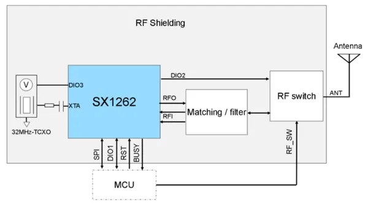
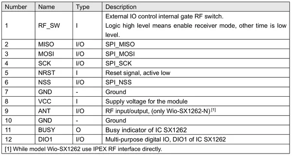

# Wio-SX1262

**Seeed Studio** · Expansion

Revision: Not identified  
Coverage: Pinout image collected

[Browse all manufacturers](../../../../BROWSE.md) · [Desktop app](https://github.com/valleytechsolutions/black-wire-desktop)

## Pinout

**pinout image** · Reviewed source · PNG

[Open original reference](../../../../library/media/60fc906dd8bae2589e891ac17fb46e8bb453dd104109d9dfe827754cd7a7be0e.png)

**Credit and rights:** Not established; source attribution retained. Source/manufacturer: Seeed Studio.

[Source 1](https://files.seeedstudio.com/wiki/XIAO_ESP32S3_for_Meshtastic_LoRa/30.png) · [Source 2](https://wiki.seeedstudio.com/wio_sx1262/)

Imported from existing Seeed Studio Board Reference; original working path preserved.

SHA-256: `60fc906dd8bae2589e891ac17fb46e8bb453dd104109d9dfe827754cd7a7be0e`

## Block Diagram

**source reference** · Unreviewed source · PNG

[Open original reference](../../../../library/media/0f8f860ef768c86115919fc635d4eac17d0588a2d664fefca4681e2e125b073c.png)

**Credit and rights:** Source rights not yet established. Source/manufacturer: Seeed Studio.

[Source 1](https://files.seeedstudio.com/wiki/XIAO_ESP32S3_for_Meshtastic_LoRa/31.png) · [Source 2](https://wiki.seeedstudio.com/wio_sx1262/)

Original source index: Block Diagram. This file is searchable but has not been promoted to a reviewed physical board pinout.

SHA-256: `0f8f860ef768c86115919fc635d4eac17d0588a2d664fefca4681e2e125b073c`

## Pin Definition Table

**source reference** · Unreviewed source · PNG

[Open original reference](../../../../library/media/d27a30f04b10f4eef876ed1749369cf67355ddcd97faedbc8b807127ced49ae1.png)

**Credit and rights:** Source rights not yet established. Source/manufacturer: Seeed Studio.

[Source 1](https://files.seeedstudio.com/wiki/XIAO_ESP32S3_for_Meshtastic_LoRa/68.jpg) · [Source 2](https://wiki.seeedstudio.com/wio_sx1262/)

Original source index: Pin Definition Table. This file is searchable but has not been promoted to a reviewed physical board pinout.

SHA-256: `d27a30f04b10f4eef876ed1749369cf67355ddcd97faedbc8b807127ced49ae1`

Pin assignments have not been independently electrically verified. Check board revision before wiring.
