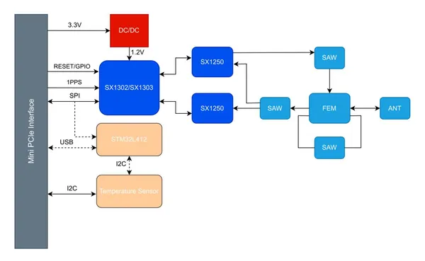
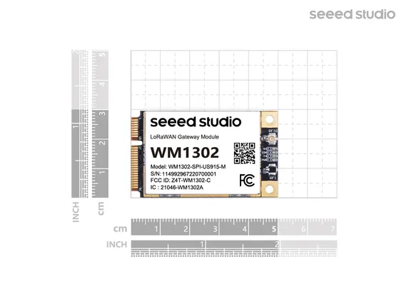
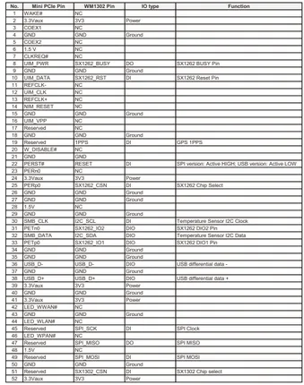

# WM1302 LoRaWAN Gateway Module

**Seeed Studio** · Expansion

Revision: Not identified  
Coverage: Pinout image collected

[Browse all manufacturers](../../../../BROWSE.md) · [Desktop app](https://github.com/valleytechsolutions/black-wire-desktop)

## Pinout

**pinout image** · Reviewed source · PNG

[Open original reference](../../../../library/media/f64af32329e3765e919568e46fd776e428219f7053b4180614d75188bc73579d.png)

**Credit and rights:** Not established; source attribution retained. Source/manufacturer: Seeed Studio.

[Source 1](https://files.seeedstudio.com/wiki/WM1302_module/WM1302_1.png) · [Source 2](https://wiki.seeedstudio.com/WM1302_module/)

Imported from existing Seeed Studio Board Reference; original working path preserved.

SHA-256: `f64af32329e3765e919568e46fd776e428219f7053b4180614d75188bc73579d`

## Block Diagram

**source reference** · Unreviewed source · JPG

[Open original reference](../../../../library/media/cc0d56643d2db645a2e856bf9776704c4950a56dc514e8121cfd90454f5d8a5d.jpg)

**Credit and rights:** Source rights not yet established. Source/manufacturer: Seeed Studio.

[Source 1](https://files.seeedstudio.com/wiki/WM1302_module/diagram.jpg) · [Source 2](https://wiki.seeedstudio.com/WM1302_module/)

Original source index: Block Diagram. This file is searchable but has not been promoted to a reviewed physical board pinout.

SHA-256: `cc0d56643d2db645a2e856bf9776704c4950a56dc514e8121cfd90454f5d8a5d`

## Dimensions

**source reference** · Unreviewed source · JPG

[Open original reference](../../../../library/media/09e7c26254f3f28fd3e626f2fee25145fb44b56ad6ab28cb5160f8da504204f4.jpg)

**Credit and rights:** Source rights not yet established. Source/manufacturer: Seeed Studio.

[Source 1](https://files.seeedstudio.com/wiki/WM1302_module/WM1302_4.jpeg) · [Source 2](https://wiki.seeedstudio.com/WM1302_module/)

Original source index: Dimensions. This file is searchable but has not been promoted to a reviewed physical board pinout.

SHA-256: `09e7c26254f3f28fd3e626f2fee25145fb44b56ad6ab28cb5160f8da504204f4`

## Pin Definition Table

**source reference** · Unreviewed source · JPG

[Open original reference](../../../../library/media/b8549d38cb213f43ae9650a20452ba6cb1874c6966195855302805433a8fa09e.jpg)

**Credit and rights:** Source rights not yet established. Source/manufacturer: Seeed Studio.

[Source 1](https://files.seeedstudio.com/wiki/WM1302_module/WM1302_2.jpeg) · [Source 2](https://wiki.seeedstudio.com/WM1302_module/)

Original source index: Pin Definition Table. This file is searchable but has not been promoted to a reviewed physical board pinout.

SHA-256: `b8549d38cb213f43ae9650a20452ba6cb1874c6966195855302805433a8fa09e`

Pin assignments have not been independently electrically verified. Check board revision before wiring.
