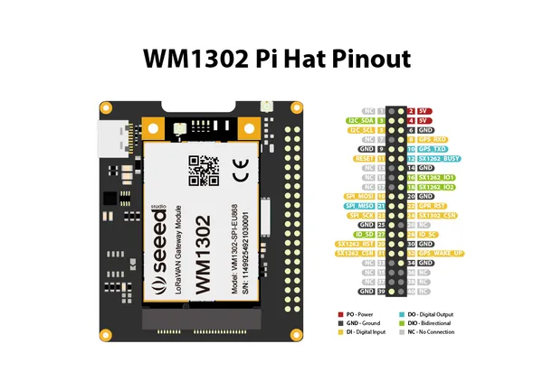
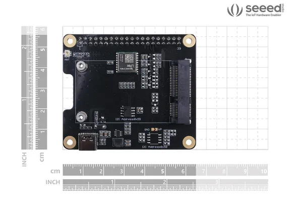
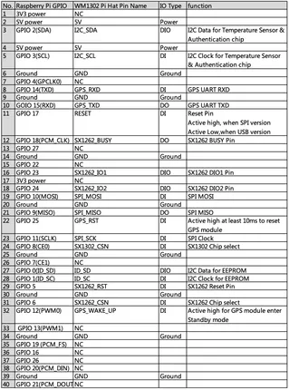

# WM1302 Pi HAT

**Seeed Studio** · Expansion

Revision: Not identified  
Coverage: Pinout image collected

[Browse all manufacturers](../../../../BROWSE.md) · [Desktop app](https://github.com/valleytechsolutions/black-wire-desktop)

## Pinout

**pinout image** · Reviewed source · PNG

[Open original reference](../../../../library/media/9730a8794cd6eaee190ffb9d72d874c3d5bf37e92cc2db6311db6455a47a43db.png)

**Credit and rights:** Not established; source attribution retained. Source/manufacturer: Seeed Studio.

[Source 1](https://files.seeedstudio.com/products/113100022/5371617183671_.pic_hd.jpg) · [Source 2](https://wiki.seeedstudio.com/WM1302_Pi_HAT/)

Imported from existing Seeed Studio Board Reference; original working path preserved.

SHA-256: `9730a8794cd6eaee190ffb9d72d874c3d5bf37e92cc2db6311db6455a47a43db`

## Dimensions

**source reference** · Unreviewed source · PNG

[Open original reference](../../../../library/media/c2dd26e07b8fbb55a5c337cbbb7d66dda1f0a95ca2f79c0f92d6a655edacb56f.png)

**Credit and rights:** Source rights not yet established. Source/manufacturer: Seeed Studio.

[Source 1](https://files.seeedstudio.com/products/113100022/WM1302%20PiHat_Size-17.png) · [Source 2](https://wiki.seeedstudio.com/WM1302_Pi_HAT/)

Original source index: Dimensions. This file is searchable but has not been promoted to a reviewed physical board pinout.

SHA-256: `c2dd26e07b8fbb55a5c337cbbb7d66dda1f0a95ca2f79c0f92d6a655edacb56f`

## Pin Definition Table

**source reference** · Unreviewed source · PNG

[Open original reference](../../../../library/media/222064ab2999929750a5ae5c4e3bf025673d08999ae908479401d4f0808bcc70.png)

**Credit and rights:** Source rights not yet established. Source/manufacturer: Seeed Studio.

[Source 1](https://files.seeedstudio.com/products/113100022/pi%20hat.png) · [Source 2](https://wiki.seeedstudio.com/WM1302_Pi_HAT/)

Original source index: Pin Definition Table. This file is searchable but has not been promoted to a reviewed physical board pinout.

SHA-256: `222064ab2999929750a5ae5c4e3bf025673d08999ae908479401d4f0808bcc70`

Pin assignments have not been independently electrically verified. Check board revision before wiring.
