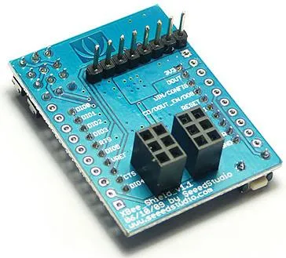
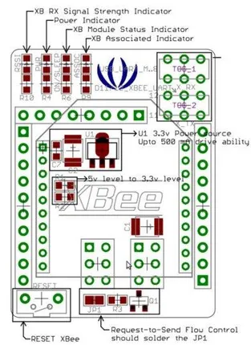

# XBee Shield

**Seeed Studio** · Expansion

Revision: Not identified

Coverage: Board labels only; pinout needed

[Browse all manufacturers](../../../../BROWSE.md) · [Devices & IoT](../../../../DEVICES.md) · [Open in the browser guide](https://valleytech-black-wire-guide.pages.dev/?board=seeed-studio-expansion-xbee-shield)

## Datasheets and original documentation

Board datasheet: **not yet recorded**. Visual reference: **available**.

[Manufacturer source (recorded link)](https://wiki.seeedstudio.com/XBee_Shield/)

A chip datasheet, schematic and board datasheet have different scopes. Match the exact hardware revision.

[Documentation coverage and remaining gaps](../../../../DOCUMENTATION.md)

## Pinout (Back)

**board labeling image** · Reviewed source · JPG

[Open original reference](../../../../library/media/8d96b2abad686dc150e7632e6685503d29ccfcd4eece74c33f503838ddbed01e.jpg)

**Credit and rights:** Not established; source attribution retained. Source/manufacturer: Seeed Studio.

[Source 1](https://files.seeedstudio.com/wiki/XBee-Shield/img/Xbshield_bottom.jpg) · [Source 2](https://wiki.seeedstudio.com/XBee_Shield/)

Imported from existing Seeed Studio Board Reference; original working path preserved.

Image revision: Not identified

SHA-256: `8d96b2abad686dc150e7632e6685503d29ccfcd4eece74c33f503838ddbed01e`

## Hardware Overview

**source reference** · Unreviewed source · JPG

[Open original reference](../../../../library/media/1324a9aaa3a94c113e98ab9f6b67563ddd66afa5dfef6e4c41a07570441d729d.jpg)

**Credit and rights:** Source rights not yet established. Source/manufacturer: Seeed Studio.

[Source 1](https://files.seeedstudio.com/wiki/XBee-Shield/img/XBee_Shield_Outline.jpg) · [Source 2](https://wiki.seeedstudio.com/XBee_Shield/)

Original source index: Hardware Overview. This file is searchable but has not been promoted to a reviewed physical board pinout.

Image revision: Not identified

SHA-256: `1324a9aaa3a94c113e98ab9f6b67563ddd66afa5dfef6e4c41a07570441d729d`

Pin assignments have not been independently electrically verified. Check board revision before wiring.
