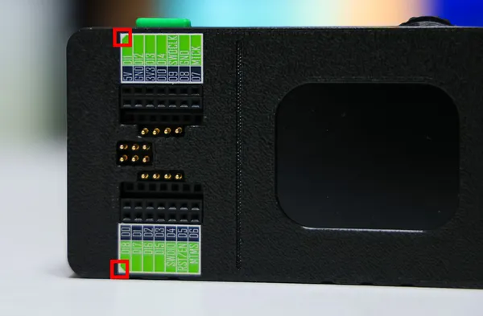
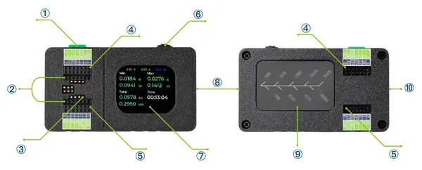

# XIAO Debug Mate

**Seeed Studio** · Expansion

Revision: Not identified  
Coverage: Partial pinout collected; full reference still needed

[Browse all manufacturers](../../../../BROWSE.md) · [Desktop app](https://github.com/valleytechsolutions/black-wire-desktop)

## Pinout (Back)

**pinout image** · Reviewed source · JPG

[Open original reference](../../../../library/media/bd85a2c5980c09ff04fc01dd5ef86674723dc1699bad9a114829a0d5426bf814.jpg)

**Credit and rights:** Not established; source attribution retained. Source/manufacturer: Seeed Studio.

[Source 1](https://files.seeedstudio.com/wiki/xiao_debug_mate/sticket_2.jpg) · [Source 2](https://wiki.seeedstudio.com/getting_started_with_xiao_debug_mate/)

Imported from existing Seeed Studio Board Reference; original working path preserved. Only the named connector or subsection is covered.

**Partial diagram. Confirm missing pins against the exact board documentation.**

SHA-256: `bd85a2c5980c09ff04fc01dd5ef86674723dc1699bad9a114829a0d5426bf814`

## Pinout (Front)

**pinout image** · Reviewed source · JPG

[Open original reference](../../../../library/media/d2b2f11ac508c45699c29d0b608edd8960800d88100d44b0531e91bf7ae344c7.jpg)

**Credit and rights:** Not established; source attribution retained. Source/manufacturer: Seeed Studio.

[Source 1](https://files.seeedstudio.com/wiki/xiao_debug_mate/sticket_1.jpg) · [Source 2](https://wiki.seeedstudio.com/getting_started_with_xiao_debug_mate/)

Imported from existing Seeed Studio Board Reference; original working path preserved. Only the named connector or subsection is covered.

**Partial diagram. Confirm missing pins against the exact board documentation.**

SHA-256: `d2b2f11ac508c45699c29d0b608edd8960800d88100d44b0531e91bf7ae344c7`

## Hardware Overview

**source reference** · Unreviewed source · PNG

[Open original reference](../../../../library/media/4e8a9e9f3ee236a754e87f39a2942b84ee1b6596b339e39c02256c778d8f8ee7.png)

**Credit and rights:** Source rights not yet established. Source/manufacturer: Seeed Studio.

[Source 1](https://files.seeedstudio.com/wiki/xiao_debug_mate/hardware_overview.png) · [Source 2](https://wiki.seeedstudio.com/getting_started_with_xiao_debug_mate/)

Original source index: Hardware Overview. This file is searchable but has not been promoted to a reviewed physical board pinout.

SHA-256: `4e8a9e9f3ee236a754e87f39a2942b84ee1b6596b339e39c02256c778d8f8ee7`

Pin assignments have not been independently electrically verified. Check board revision before wiring.
