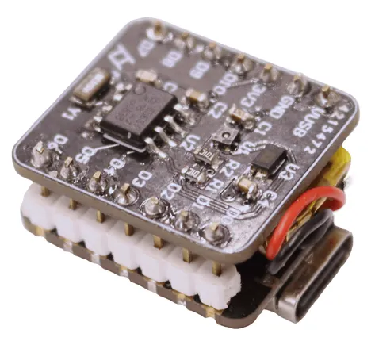
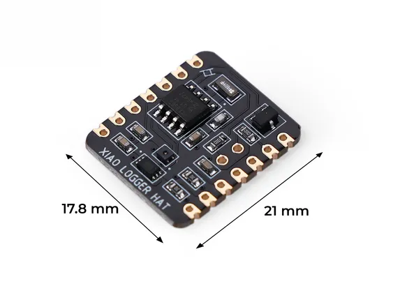

# XIAO Logger HAT

**Seeed Studio** · Expansion

Revision: Not identified  
Coverage: Board labels only; pinout needed

[Browse all manufacturers](../../../../BROWSE.md) · [Desktop app](https://github.com/valleytechsolutions/black-wire-desktop)

## Pinout

**board labeling image** · Reviewed source · PNG

[Open original reference](../../../../library/media/b27d4d2a125843ce1c3b85b7bfdbba46712a781a3c7709557a3b03ff92f4f13a.png)

**Credit and rights:** Not established; source attribution retained. Source/manufacturer: Seeed Studio.

[Source 1](https://raw.githubusercontent.com/potblitd/XIAO-log/main/images/xiao-log-assembly.png) · [Source 2](https://github.com/potblitd/XIAO-log (linked from the Seeed product page's "Wiki & Learn" tab as the co-create documentation repo))

Imported from existing Seeed Studio Board Reference; original working path preserved.

SHA-256: `b27d4d2a125843ce1c3b85b7bfdbba46712a781a3c7709557a3b03ff92f4f13a`

## Dimensions

**source reference** · Unreviewed source · JPG

[Open original reference](../../../../library/media/d458e652f4d6f89927f024a412a2c3d7d3efa3f2885f2dcbf015848b3f165178.jpg)

**Credit and rights:** Source rights not yet established. Source/manufacturer: Seeed Studio.

[Source 1](https://media-cdn.seeedstudio.com/media/catalog/product/6/-/6-114993446-xiao-log-size.jpg) · [Source 2](https://www.seeedstudio.com/XIAO-LOG-p-6341.html)

Original source index: Dimensions. This file is searchable but has not been promoted to a reviewed physical board pinout.

SHA-256: `d458e652f4d6f89927f024a412a2c3d7d3efa3f2885f2dcbf015848b3f165178`

Pin assignments have not been independently electrically verified. Check board revision before wiring.
