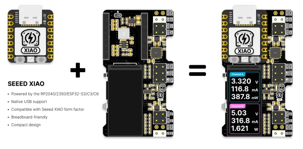
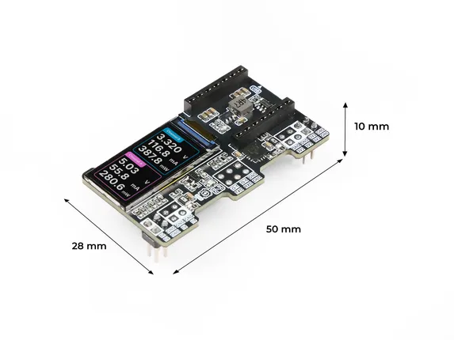
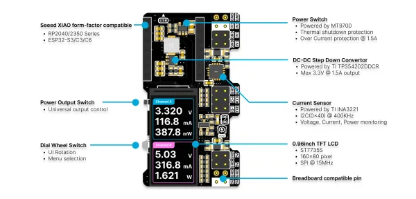

# XIAO PowerBread

**Seeed Studio** · Expansion

Revision: Not identified  
Coverage: Board labels only; pinout needed

[Browse all manufacturers](../../../../BROWSE.md) · [Desktop app](https://github.com/valleytechsolutions/black-wire-desktop)

## Pinout

**board labeling image** · Reviewed source · WEBP

[Open original reference](../../../../library/media/91ec0aed09d7ac29a5f52321f4682dc1cdbbf2cdf911b1de6dbb1d818afcdd6a.webp)

**Credit and rights:** Not established; source attribution retained. Source/manufacturer: Seeed Studio.

[Source 1](https://raw.githubusercontent.com/nicho810/XIAO-PowerBread/main/Docs/Images/pic_overview.webp) · [Source 2](https://github.com/nicho810/XIAO-PowerBread (linked from the Seeed product page's "Wiki & Learn" tab / official designer repo))

Imported from existing Seeed Studio Board Reference; original working path preserved.

SHA-256: `91ec0aed09d7ac29a5f52321f4682dc1cdbbf2cdf911b1de6dbb1d818afcdd6a`

## Dimensions

**source reference** · Unreviewed source · JPG

[Open original reference](../../../../library/media/456e69d514671cd01f5a3d120eea47d2dcf19ac2f3c7f7c6cc3ca84423ffcd06.jpg)

**Credit and rights:** Source rights not yet established. Source/manufacturer: Seeed Studio.

[Source 1](https://media-cdn.seeedstudio.com/media/catalog/product/5/-/5-114993507-xiao-powerbread-size.jpg) · [Source 2](https://www.seeedstudio.com/XIAO-PowerBread-p-6318.html)

Original source index: Dimensions. This file is searchable but has not been promoted to a reviewed physical board pinout.

SHA-256: `456e69d514671cd01f5a3d120eea47d2dcf19ac2f3c7f7c6cc3ca84423ffcd06`

## Hardware Overview

**source reference** · Unreviewed source · WEBP

[Open original reference](../../../../library/media/3f89840ec31f20a40475e1f2c023969634fd3554f6f41086d3b1a6dd86366623.webp)

**Credit and rights:** Source rights not yet established. Source/manufacturer: Seeed Studio.

[Source 1](https://raw.githubusercontent.com/nicho810/XIAO-PowerBread/main/Docs/Images/pic_hardwareSpec.webp) · [Source 2](https://github.com/nicho810/XIAO-PowerBread (linked from the Seeed product page's "Wiki & Learn" tab / official designer repo))

Original source index: Hardware Overview. This file is searchable but has not been promoted to a reviewed physical board pinout.

SHA-256: `3f89840ec31f20a40475e1f2c023969634fd3554f6f41086d3b1a6dd86366623`

Pin assignments have not been independently electrically verified. Check board revision before wiring.
