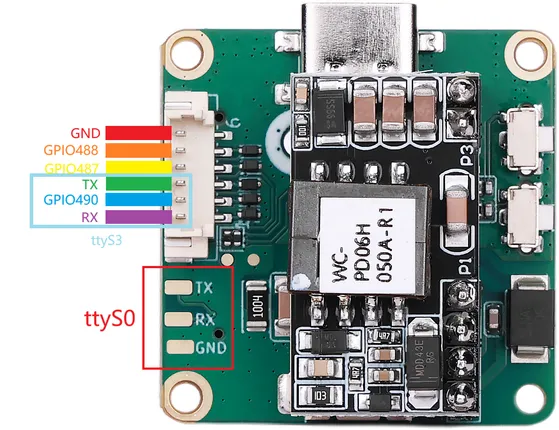
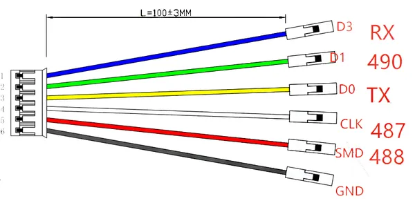

# reCamera HQ PoE

**Seeed Studio** · GPIO device

Revision: Not identified  
Coverage: Partial pinout collected; full reference still needed

[Browse all manufacturers](../../../../BROWSE.md) · [Desktop app](https://github.com/valleytechsolutions/black-wire-desktop)

## Pinout (Debug UART)

**pinout image** · Reviewed source · PNG

[Open original reference](../../../../library/media/6b6ddedb37088c4c9eaa543f397650b06d3595fcd322c2bb71477abdbd604496.png)

**Credit and rights:** Not established; source attribution retained. Source/manufacturer: Seeed Studio.

[Source 1](https://files.seeedstudio.com/wiki/reCamera/reCamera_hq_poe/POE_pinout.png) · [Source 2](https://wiki.seeedstudio.com/reCamera_hq_poe_hardware_and_specs/)

Imported from existing Seeed Studio Board Reference; original working path preserved. Only the named connector or subsection is covered.

**Partial diagram. Confirm missing pins against the exact board documentation.**

SHA-256: `6b6ddedb37088c4c9eaa543f397650b06d3595fcd322c2bb71477abdbd604496`

## Pin Functions (Lens-IO Connector)

**source reference** · Unreviewed source · PNG

[Open original reference](../../../../library/media/ba3ec9fa80d3b97877a35e4482a8971acd202fcf5782b010a27b06ec50d948d3.png)

**Credit and rights:** Source rights not yet established. Source/manufacturer: Seeed Studio.

[Source 1](https://files.seeedstudio.com/wiki/reCamera/reCamera_hq_poe/IO_Lens_6.png) · [Source 2](https://wiki.seeedstudio.com/reCamera_hq_poe_hardware_and_specs/)

Original source index: Pin Functions (Lens-IO Connector). This file is searchable but has not been promoted to a reviewed physical board pinout.

SHA-256: `ba3ec9fa80d3b97877a35e4482a8971acd202fcf5782b010a27b06ec50d948d3`

Pin assignments have not been independently electrically verified. Check board revision before wiring.
