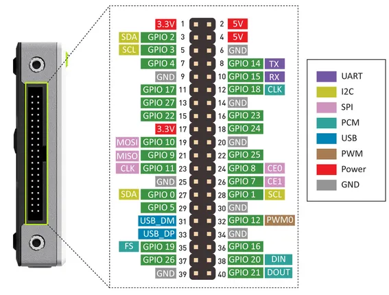
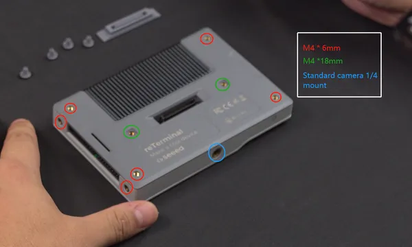
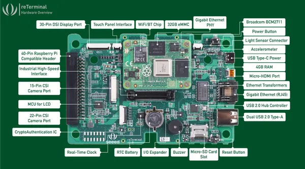
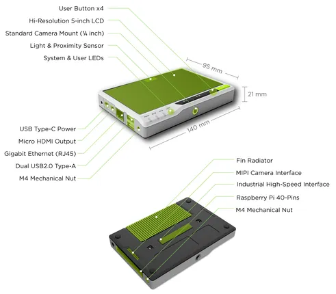

# reTerminal

**Seeed Studio** · GPIO device

Revision: Not identified  
Coverage: Pinout image collected

[Browse all manufacturers](../../../../BROWSE.md) · [Desktop app](https://github.com/valleytechsolutions/black-wire-desktop)

## Pinout

**pinout image** · Reviewed source · JPG

[Open original reference](../../../../library/media/9d189da2f85eee8ad9943d9ed4bc1bc840bf61ff0ae375ec49a74ae8d9a151d6.jpg)

**Credit and rights:** Not established; source attribution retained. Source/manufacturer: Seeed Studio.

[Source 1](https://files.seeedstudio.com/wiki/ReTerminal/pinout-v2.jpg) · [Source 2](https://wiki.seeedstudio.com/reTerminal-hardware-interfaces-usage/)

Imported from existing Seeed Studio Board Reference; original working path preserved.

SHA-256: `9d189da2f85eee8ad9943d9ed4bc1bc840bf61ff0ae375ec49a74ae8d9a151d6`

## Dimensions

**source reference** · Unreviewed source · PNG

[Open original reference](../../../../library/media/6366f7ae56fb2d575e33faaa21580b62d3e62dbe436c0408f1e829d01edee0aa.png)

**Credit and rights:** Source rights not yet established. Source/manufacturer: Seeed Studio.

[Source 1](https://files.seeedstudio.com/wiki/reTerminal_Mount_Options/12.png) · [Source 2](https://wiki.seeedstudio.com/reTerminal_Mount_Options/)

Original source index: Dimensions. This file is searchable but has not been promoted to a reviewed physical board pinout.

SHA-256: `6366f7ae56fb2d575e33faaa21580b62d3e62dbe436c0408f1e829d01edee0aa`

## Hardware Overview (Inside)

**source reference** · Unreviewed source · JPG

[Open original reference](../../../../library/media/5a6c11edc60141af95e4746e0ff2b0d6d4d87c08b8d118d2b857c94e5f206709.jpg)

**Credit and rights:** Source rights not yet established. Source/manufacturer: Seeed Studio.

[Source 1](https://files.seeedstudio.com/wiki/ReTerminal/hw-overview-internal-v1.3.jpg) · [Source 2](https://wiki.seeedstudio.com/reTerminal-hardware-interfaces-usage/)

Original source index: Hardware Overview (Inside). This file is searchable but has not been promoted to a reviewed physical board pinout.

SHA-256: `5a6c11edc60141af95e4746e0ff2b0d6d4d87c08b8d118d2b857c94e5f206709`

## Hardware Overview

**source reference** · Unreviewed source · PNG

[Open original reference](../../../../library/media/18f322ad72a2bf65f9f937a0314802f91a55dfb6e1b2f5f9057eff73bb803ab6.png)

**Credit and rights:** Source rights not yet established. Source/manufacturer: Seeed Studio.

[Source 1](https://files.seeedstudio.com/wiki/ReTerminal/HW_overview.png) · [Source 2](https://wiki.seeedstudio.com/reTerminal-hardware-interfaces-usage/)

Original source index: Hardware Overview. This file is searchable but has not been promoted to a reviewed physical board pinout.

SHA-256: `18f322ad72a2bf65f9f937a0314802f91a55dfb6e1b2f5f9057eff73bb803ab6`

Pin assignments have not been independently electrically verified. Check board revision before wiring.
