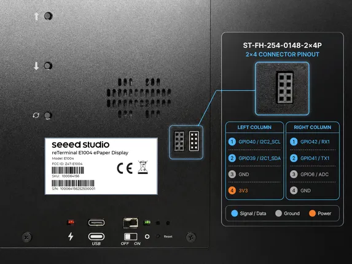
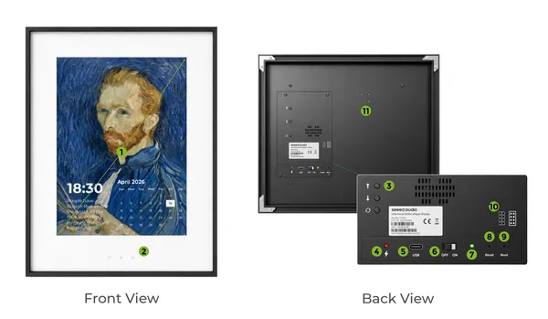

# reTerminal E1004

**Seeed Studio** · GPIO device

Revision: Not identified  
Coverage: Partial pinout collected; full reference still needed

[Browse all manufacturers](../../../../BROWSE.md) · [Devices & IoT](../../../../DEVICES.md) · [Open in the browser guide](https://valleytech-black-wire-guide.pages.dev/?board=seeed-studio-gpio-device-reterminal-e1004)

Device category: **Displays & HMI**

## Pinout

**pinout image** · Reviewed source · PNG

[Open original reference](../../../../library/media/b5d85d6b63c54f40efa3f4dae043f008feffe2dec55f1f628ce863d1461450ef.png)

**Credit and rights:** Not established; source attribution retained. Source/manufacturer: Seeed Studio.

[Source 1](https://files.seeedstudio.com/wiki/reterminal_e10xx/img/217.png) · [Source 2](https://wiki.seeedstudio.com/getting_started_with_reterminal_e1004/)

Imported from existing Seeed Studio Board Reference; original working path preserved. Only the named connector or subsection is covered.

Image revision: Not identified

SHA-256: `b5d85d6b63c54f40efa3f4dae043f008feffe2dec55f1f628ce863d1461450ef`

## Hardware Overview

**source reference** · Unreviewed source · PNG

[Open original reference](../../../../library/media/095a99c2468816a13f32cc0f8946d8dd68bcba8e2ca7eb8b26e469655b58aa8b.png)

**Credit and rights:** Source rights not yet established. Source/manufacturer: Seeed Studio.

[Source 1](https://files.seeedstudio.com/wiki/reterminal_e10xx/img/209.png) · [Source 2](https://wiki.seeedstudio.com/getting_started_with_reterminal_e1004/)

Original source index: Hardware Overview. This file is searchable but has not been promoted to a reviewed physical board pinout.

Image revision: Not identified

SHA-256: `095a99c2468816a13f32cc0f8946d8dd68bcba8e2ca7eb8b26e469655b58aa8b`

Pin assignments have not been independently electrically verified. Check board revision before wiring.
