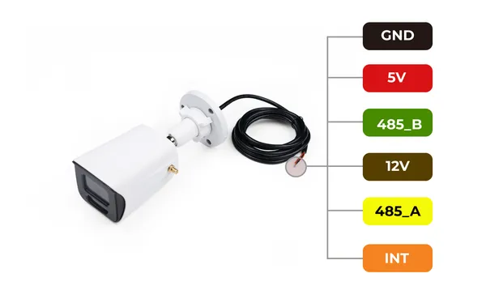

# RS485 Vision AI Camera

**Seeed Studio** · GPIO device

Revision: Not identified  
Coverage: Partial pinout collected; full reference still needed

[Browse all manufacturers](../../../../BROWSE.md) · [Desktop app](https://github.com/valleytechsolutions/black-wire-desktop)

## Pinout

**pinout image** · Reviewed source · PNG

[Open original reference](../../../../library/media/bd8f2a782807c8bcf917fc55ab456a1082df4bca5bcfcd38ff7fac4f1e738417.png)

**Credit and rights:** Not established; source attribution retained. Source/manufacturer: Seeed Studio.

[Source 1](https://files.seeedstudio.com/wiki/A1102/SenseCraft_AI_With_A1102/pin.png) · [Source 2](https://wiki.seeedstudio.com/getting_started_with_rs485_vision_ai_cam/)

Imported from existing Seeed Studio Board Reference; original working path preserved. Only the named connector or subsection is covered.

**Partial diagram. Confirm missing pins against the exact board documentation.**

SHA-256: `bd8f2a782807c8bcf917fc55ab456a1082df4bca5bcfcd38ff7fac4f1e738417`

Pin assignments have not been independently electrically verified. Check board revision before wiring.
