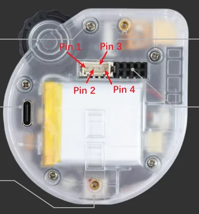

# SenseCAP Watcher for XiaoZhi

**Seeed Studio** · GPIO device

Revision: Not identified  
Coverage: Board labels only; pinout needed

[Browse all manufacturers](../../../../BROWSE.md) · [Devices & IoT](../../../../DEVICES.md) · [Open in the browser guide](https://valleytech-black-wire-guide.pages.dev/?board=seeed-studio-gpio-device-sensecap-watcher-for-xiaozhi)

Device category: **Wearables**

## Pinout

**board labeling image** · Reviewed source · PNG

[Open original reference](../../../../library/media/24bc39842ab673c1cde915dd5f680954d105cd71a8d3a23ab3071b35fde37ea3.png)

**Credit and rights:** Not established; source attribution retained. Source/manufacturer: Seeed Studio.

[Source 1](http://files.seeedstudio.com/wiki/Watcher_Agent/Grove/Grove2.png) · [Source 2](https://wiki.seeedstudio.com/extending_grove_with_mcp/)

Imported from existing Seeed Studio Board Reference; original working path preserved.

Image revision: Not identified

SHA-256: `24bc39842ab673c1cde915dd5f680954d105cd71a8d3a23ab3071b35fde37ea3`

Pin assignments have not been independently electrically verified. Check board revision before wiring.
