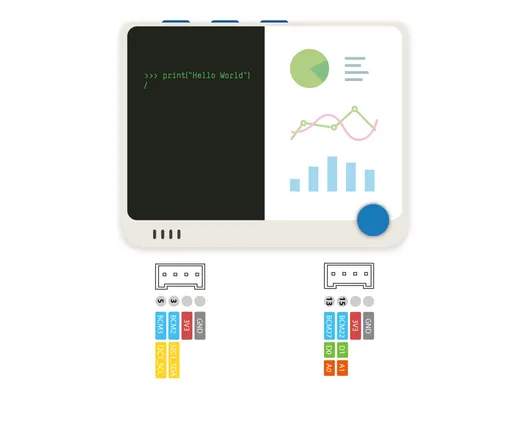
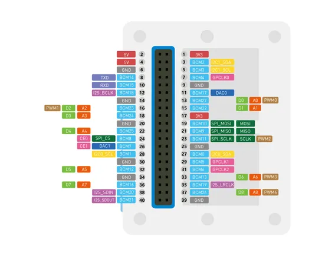
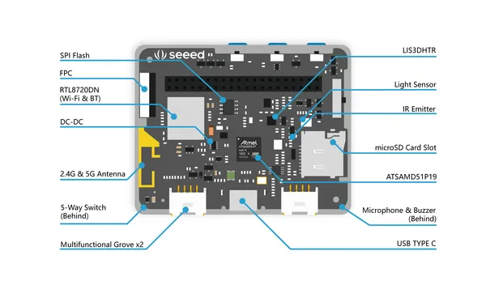
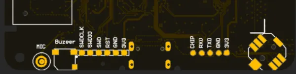
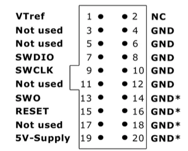

# Wio Terminal

**Seeed Studio** · GPIO device

Revision: Not identified  
Coverage: Pinout image collected

[Browse all manufacturers](../../../../BROWSE.md) · [Desktop app](https://github.com/valleytechsolutions/black-wire-desktop)

## Pinout (Grove)

**pinout image** · Reviewed source · JPG

[Open original reference](../../../../library/media/63f91d125d4191ea30cf3aa574c0577b4570469862bcb3de9ce6f2e97bff4993.jpg)

**Credit and rights:** Not established; source attribution retained. Source/manufacturer: Seeed Studio.

[Source 1](https://files.seeedstudio.com/wiki/Wio-Terminal/img/Xnip2020-03-03_12-28-29.jpg) · [Source 2](https://wiki.seeedstudio.com/Wio-Terminal-IO-Overview/)

Imported from existing Seeed Studio Board Reference; original working path preserved. Only the named connector or subsection is covered.

**Partial diagram. Confirm missing pins against the exact board documentation.**

SHA-256: `63f91d125d4191ea30cf3aa574c0577b4570469862bcb3de9ce6f2e97bff4993`

## Pinout

**pinout image** · Reviewed source · JPG

[Open original reference](../../../../library/media/16b1b25abf9851642672128a765aa3f0111a022514f51566e19131c634e0b444.jpg)

**Credit and rights:** Not established; source attribution retained. Source/manufacturer: Seeed Studio.

[Source 1](https://files.seeedstudio.com/wiki/Wio-Terminal/img/WioT-Pinout.jpg) · [Source 2](https://wiki.seeedstudio.com/Wio-Terminal-IO-Overview/)

Imported from existing Seeed Studio Board Reference; original working path preserved.

SHA-256: `16b1b25abf9851642672128a765aa3f0111a022514f51566e19131c634e0b444`

## Dimensions (Back)

**source reference** · Unreviewed source · PDF

[Open original reference](../../../../library/media/28562c2ef7e2082ad47fa471c9765259f914027e1c49705f045a1e8425aca579.pdf)

**Credit and rights:** Source rights not yet established. Source/manufacturer: Seeed Studio.

[Source 1](https://files.seeedstudio.com/wiki/Wio-Terminal/res/Wio-Terminal-Main-Back-V3.0-White-72x57x7.1mm.pdf) · [Source 2](https://wiki.seeedstudio.com/Wio-Terminal-Getting-Started/)

Original source index: Dimensions (Back). This file is searchable but has not been promoted to a reviewed physical board pinout.

SHA-256: `28562c2ef7e2082ad47fa471c9765259f914027e1c49705f045a1e8425aca579`

## Dimensions (Front)

**source reference** · Unreviewed source · PDF

[Open original reference](../../../../library/media/f1f7d04dc711a7e5b29bc6f7808b0247e286b4d6b9963f1edf6f6d925c3bb5bf.pdf)

**Credit and rights:** Source rights not yet established. Source/manufacturer: Seeed Studio.

[Source 1](https://files.seeedstudio.com/wiki/Wio-Terminal/res/Wio-Terminal-Main-V3.0-White-72x57x10.4mm.pdf) · [Source 2](https://wiki.seeedstudio.com/Wio-Terminal-Getting-Started/)

Original source index: Dimensions (Front). This file is searchable but has not been promoted to a reviewed physical board pinout.

SHA-256: `f1f7d04dc711a7e5b29bc6f7808b0247e286b4d6b9963f1edf6f6d925c3bb5bf`

## Hardware Overview

**source reference** · Unreviewed source · PNG

[Open original reference](../../../../library/media/1fab42abd1e7b7a5f5de24b574f7303d4887ccab2d319577f96b12a3148f79f5.png)

**Credit and rights:** Source rights not yet established. Source/manufacturer: Seeed Studio.

[Source 1](https://files.seeedstudio.com/wiki/Wio-Terminal/img/WioT-Hardware-OverviewNew.png) · [Source 2](https://wiki.seeedstudio.com/Wio-Terminal-Getting-Started/)

Original source index: Hardware Overview. This file is searchable but has not been promoted to a reviewed physical board pinout.

SHA-256: `1fab42abd1e7b7a5f5de24b574f7303d4887ccab2d319577f96b12a3148f79f5`

## Pin Definition (Debug Pads)

**source reference** · Unreviewed source · PNG

[Open original reference](../../../../library/media/de0dcddd431bb59d976749984ece7b654dc99cd0f0e138966581c2c567477d6d.png)

**Credit and rights:** Source rights not yet established. Source/manufacturer: Seeed Studio.

[Source 1](https://files.seeedstudio.com/wiki/DAPLink/daplink-wt.jpg) · [Source 2](https://wiki.seeedstudio.com/Wio-Terminal-DAPLink/)

Original source index: Pin Definition (Debug Pads). This file is searchable but has not been promoted to a reviewed physical board pinout.

SHA-256: `de0dcddd431bb59d976749984ece7b654dc99cd0f0e138966581c2c567477d6d`

## Pin Definition Table (SWD)

**source reference** · Unreviewed source · PNG

[Open original reference](../../../../library/media/354abd49b6dfc2f0d28c9d8ef170da16db47b049eb7493964b144635f8733752.png)

**Credit and rights:** Source rights not yet established. Source/manufacturer: Seeed Studio.

[Source 1](https://files.seeedstudio.com/wiki/SWD/pinout.png) · [Source 2](https://wiki.seeedstudio.com/Software-SWD/)

Original source index: Pin Definition Table (SWD). This file is searchable but has not been promoted to a reviewed physical board pinout.

SHA-256: `354abd49b6dfc2f0d28c9d8ef170da16db47b049eb7493964b144635f8733752`

Pin assignments have not been independently electrically verified. Check board revision before wiring.
