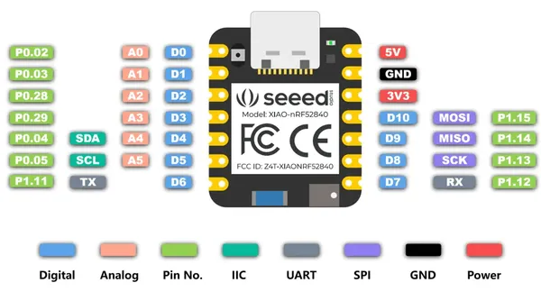
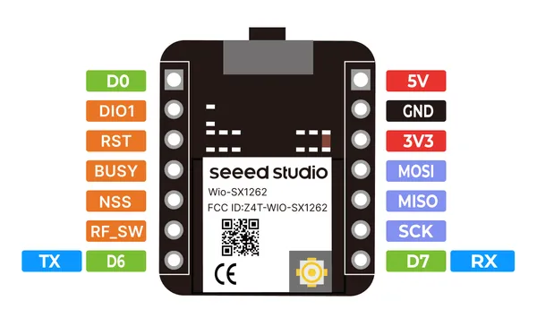

# XIAO nRF52840 & Wio-SX1262 Kit

**Seeed Studio** · nRF52840

Revision: Not identified  
Coverage: Pinout image collected

[Browse all manufacturers](../../../../BROWSE.md) · [Desktop app](https://github.com/valleytechsolutions/black-wire-desktop)

## Pinout 2

**pinout image** · Reviewed source · PNG

[Open original reference](../../../../library/media/2238cdda0e0a4ec017cd6a5386555531e0546b42fa0da592b07a38491c66143b.png)

**Credit and rights:** Not established; source attribution retained. Source/manufacturer: Seeed Studio.

[Source 1](https://media-cdn.seeedstudio.com/media/wysiwyg/upload/imageXIAO_nRF52840-2.png) · [Source 2](https://wiki.seeedstudio.com/xiao_nrf52840&_wio_SX1262_kit_for_meshtastic/)

Imported from existing Seeed Studio Board Reference; original working path preserved.

SHA-256: `2238cdda0e0a4ec017cd6a5386555531e0546b42fa0da592b07a38491c66143b`

## Pinout

**pinout image** · Reviewed source · PNG

[Open original reference](../../../../library/media/2e2da6a1dbe9b4e9fd7d09e58e9c12d324dcddcef4f09767fb748721154214ac.png)

**Credit and rights:** Not established; source attribution retained. Source/manufacturer: Seeed Studio.

[Source 1](https://media-cdn.seeedstudio.com/media/wysiwyg/upload/image_Wio-SX1262_-1.png) · [Source 2](https://wiki.seeedstudio.com/xiao_nrf52840&_wio_SX1262_kit_for_meshtastic/)

Imported from existing Seeed Studio Board Reference; original working path preserved.

SHA-256: `2e2da6a1dbe9b4e9fd7d09e58e9c12d324dcddcef4f09767fb748721154214ac`

Pin assignments have not been independently electrically verified. Check board revision before wiring.
