# BeagleBone Green Wireless

**Seeed Studio** · Other SBC

Revision: Not identified  
Coverage: Pinout image collected

[Browse all manufacturers](../../../../BROWSE.md) · [Desktop app](https://github.com/valleytechsolutions/black-wire-desktop)

## Pinout

**pinout image** · Reviewed source · JPG

[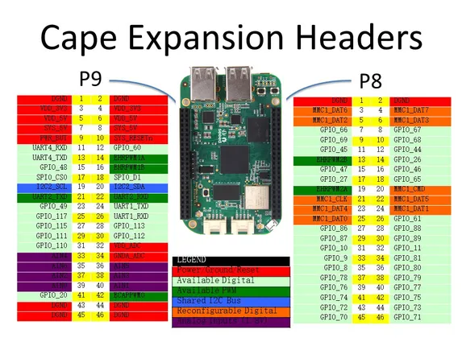](../../../../library/media/95f02c356d819f98fdc505e852a402d77d14ab17952629bc01ebf418557ce0cd.jpg)

[Open original reference](../../../../library/media/95f02c356d819f98fdc505e852a402d77d14ab17952629bc01ebf418557ce0cd.jpg)

**Credit and rights:** Not established; source attribution retained. Source/manufacturer: Seeed Studio.

[Source 1](https://files.seeedstudio.com/wiki/BeagleBone_Green_Wireless/images/BeagleBoneGreenWirelessPins.jpg) · [Source 2](https://wiki.seeedstudio.com/BeagleBone_Green_Wireless/)

Imported from existing Seeed Studio Board Reference; original working path preserved.

SHA-256: `95f02c356d819f98fdc505e852a402d77d14ab17952629bc01ebf418557ce0cd`

## Dimensions 2

**source reference** · Unreviewed source · PNG

[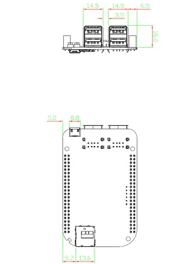](../../../../library/media/50d71bc5df75c1716fdbf9c881abc0689bf9388f8274da495a538a9d1d88775b.png)

[Open original reference](../../../../library/media/50d71bc5df75c1716fdbf9c881abc0689bf9388f8274da495a538a9d1d88775b.png)

**Credit and rights:** Source rights not yet established. Source/manufacturer: Seeed Studio.

Original source index: Dimensions 2. This file is searchable but has not been promoted to a reviewed physical board pinout.

SHA-256: `50d71bc5df75c1716fdbf9c881abc0689bf9388f8274da495a538a9d1d88775b`

## Dimensions

**source reference** · Unreviewed source · PNG

[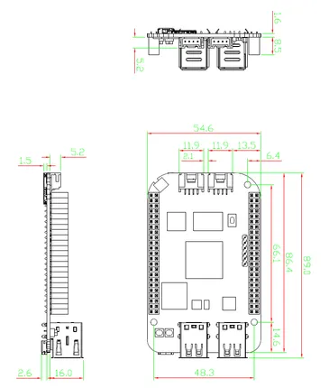](../../../../library/media/4e1625900c93b822e3ada43a0838c479ab85b8afa2b1a8e1d4403a5337389973.png)

[Open original reference](../../../../library/media/4e1625900c93b822e3ada43a0838c479ab85b8afa2b1a8e1d4403a5337389973.png)

**Credit and rights:** Source rights not yet established. Source/manufacturer: Seeed Studio.

Original source index: Dimensions. This file is searchable but has not been promoted to a reviewed physical board pinout.

SHA-256: `4e1625900c93b822e3ada43a0838c479ab85b8afa2b1a8e1d4403a5337389973`

## Hardware Overview

**source reference** · Unreviewed source · PNG

[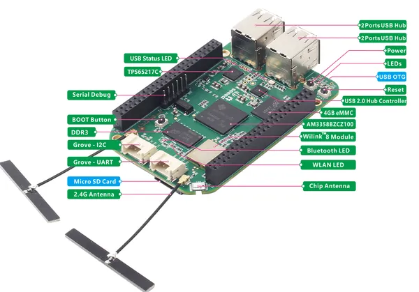](../../../../library/media/63536670c59609cc1d158c28069d273b7a16af3b0069154f6dac5effadc2cbf0.png)

[Open original reference](../../../../library/media/63536670c59609cc1d158c28069d273b7a16af3b0069154f6dac5effadc2cbf0.png)

**Credit and rights:** Source rights not yet established. Source/manufacturer: Seeed Studio.

Original source index: Hardware Overview. This file is searchable but has not been promoted to a reviewed physical board pinout.

SHA-256: `63536670c59609cc1d158c28069d273b7a16af3b0069154f6dac5effadc2cbf0`

## Pin Definition Table (MRAA ADC)

**source reference** · Unreviewed source · PNG

[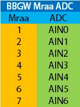](../../../../library/media/d68b96f66e7144794d768b1f26a8b4e402fe177c100953822b4e016f3f58e23b.png)

[Open original reference](../../../../library/media/d68b96f66e7144794d768b1f26a8b4e402fe177c100953822b4e016f3f58e23b.png)

**Credit and rights:** Source rights not yet established. Source/manufacturer: Seeed Studio.

Original source index: Pin Definition Table (MRAA ADC). This file is searchable but has not been promoted to a reviewed physical board pinout.

SHA-256: `d68b96f66e7144794d768b1f26a8b4e402fe177c100953822b4e016f3f58e23b`

## Pin Definition Table (MRAA GPIO)

**source reference** · Unreviewed source · PNG

[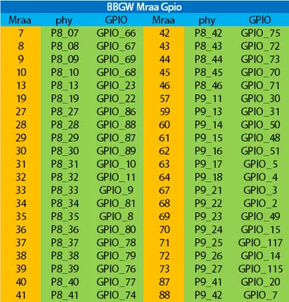](../../../../library/media/3d7506d500e7cc06849b857084073d826df0d24c4af9bebd35f326b8dea3d674.png)

[Open original reference](../../../../library/media/3d7506d500e7cc06849b857084073d826df0d24c4af9bebd35f326b8dea3d674.png)

**Credit and rights:** Source rights not yet established. Source/manufacturer: Seeed Studio.

Original source index: Pin Definition Table (MRAA GPIO). This file is searchable but has not been promoted to a reviewed physical board pinout.

SHA-256: `3d7506d500e7cc06849b857084073d826df0d24c4af9bebd35f326b8dea3d674`

## Pin Definition Table (MRAA I2C)

**source reference** · Unreviewed source · PNG

[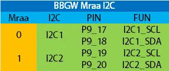](../../../../library/media/ae62048564146dfe82b7a16d00db6d936d8bfd5b988d26a893c91eafe4ac71c6.png)

[Open original reference](../../../../library/media/ae62048564146dfe82b7a16d00db6d936d8bfd5b988d26a893c91eafe4ac71c6.png)

**Credit and rights:** Source rights not yet established. Source/manufacturer: Seeed Studio.

Original source index: Pin Definition Table (MRAA I2C). This file is searchable but has not been promoted to a reviewed physical board pinout.

SHA-256: `ae62048564146dfe82b7a16d00db6d936d8bfd5b988d26a893c91eafe4ac71c6`

## Pin Definition Table (MRAA PWM)

**source reference** · Unreviewed source · PNG

[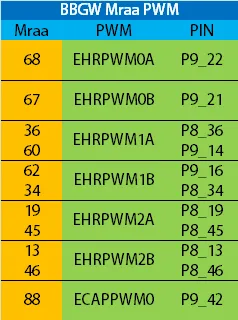](../../../../library/media/58f2f0d719b14fab0e3a7a24812ec86e1d9af77778fee05e7091b9db8c3dc7fe.png)

[Open original reference](../../../../library/media/58f2f0d719b14fab0e3a7a24812ec86e1d9af77778fee05e7091b9db8c3dc7fe.png)

**Credit and rights:** Source rights not yet established. Source/manufacturer: Seeed Studio.

Original source index: Pin Definition Table (MRAA PWM). This file is searchable but has not been promoted to a reviewed physical board pinout.

SHA-256: `58f2f0d719b14fab0e3a7a24812ec86e1d9af77778fee05e7091b9db8c3dc7fe`

## Pin Definition Table (MRAA UART)

**source reference** · Unreviewed source · PNG

[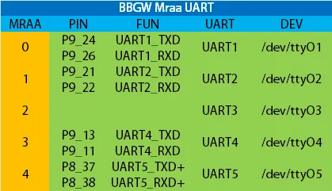](../../../../library/media/de6a13ae649b95f76a6fc1803d2ed31ece20617c2737ff43a859be0217573cfd.png)

[Open original reference](../../../../library/media/de6a13ae649b95f76a6fc1803d2ed31ece20617c2737ff43a859be0217573cfd.png)

**Credit and rights:** Source rights not yet established. Source/manufacturer: Seeed Studio.

Original source index: Pin Definition Table (MRAA UART). This file is searchable but has not been promoted to a reviewed physical board pinout.

SHA-256: `de6a13ae649b95f76a6fc1803d2ed31ece20617c2737ff43a859be0217573cfd`

## Pin Multiplexing (Analog)

**source reference** · Unreviewed source · PNG

[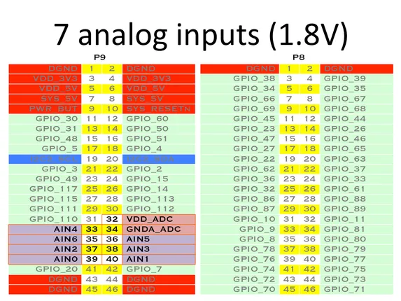](../../../../library/media/c87e35cc7f9169ceb2195b17b6bbeedfe26a26b77e94990491f47d039dc31d49.png)

[Open original reference](../../../../library/media/c87e35cc7f9169ceb2195b17b6bbeedfe26a26b77e94990491f47d039dc31d49.png)

**Credit and rights:** Source rights not yet established. Source/manufacturer: Seeed Studio.

Original source index: Pin Multiplexing (Analog). This file is searchable but has not been promoted to a reviewed physical board pinout.

SHA-256: `c87e35cc7f9169ceb2195b17b6bbeedfe26a26b77e94990491f47d039dc31d49`

## Pin Multiplexing (I2C)

**source reference** · Unreviewed source · PNG

[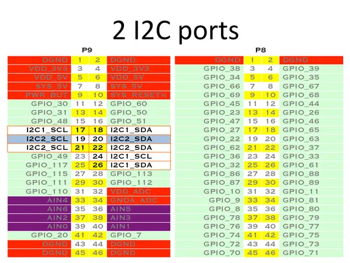](../../../../library/media/7c3e3640933f7e77263adf8033a48cb7e4bc901cd6e5da4602e7aafb051e1162.png)

[Open original reference](../../../../library/media/7c3e3640933f7e77263adf8033a48cb7e4bc901cd6e5da4602e7aafb051e1162.png)

**Credit and rights:** Source rights not yet established. Source/manufacturer: Seeed Studio.

Original source index: Pin Multiplexing (I2C). This file is searchable but has not been promoted to a reviewed physical board pinout.

SHA-256: `7c3e3640933f7e77263adf8033a48cb7e4bc901cd6e5da4602e7aafb051e1162`

## Pin Multiplexing (PWM)

**source reference** · Unreviewed source · PNG

[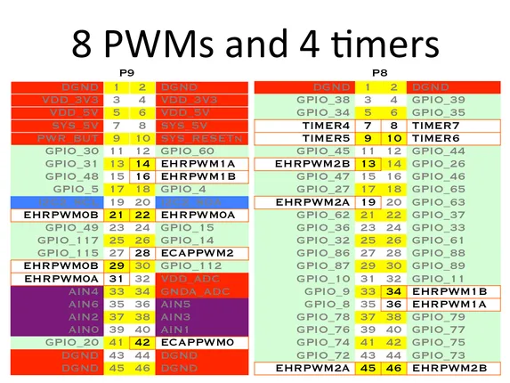](../../../../library/media/0946e708411b1cde26f076ad5c9a38fd8dbf8be4fa90029bcb194872ac460902.png)

[Open original reference](../../../../library/media/0946e708411b1cde26f076ad5c9a38fd8dbf8be4fa90029bcb194872ac460902.png)

**Credit and rights:** Source rights not yet established. Source/manufacturer: Seeed Studio.

Original source index: Pin Multiplexing (PWM). This file is searchable but has not been promoted to a reviewed physical board pinout.

SHA-256: `0946e708411b1cde26f076ad5c9a38fd8dbf8be4fa90029bcb194872ac460902`

## Pin Multiplexing (SPI)

**source reference** · Unreviewed source · PNG

[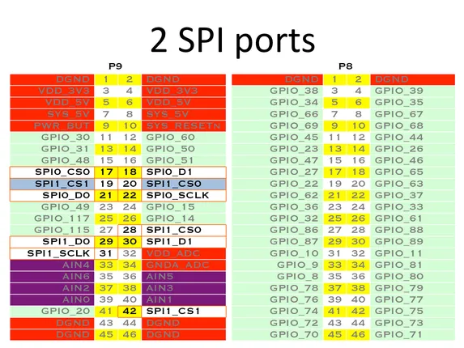](../../../../library/media/7c2c09a7093cb1e3d360e2c0e559dfb18ec29ce97c5373e43b15735f03561266.png)

[Open original reference](../../../../library/media/7c2c09a7093cb1e3d360e2c0e559dfb18ec29ce97c5373e43b15735f03561266.png)

**Credit and rights:** Source rights not yet established. Source/manufacturer: Seeed Studio.

Original source index: Pin Multiplexing (SPI). This file is searchable but has not been promoted to a reviewed physical board pinout.

SHA-256: `7c2c09a7093cb1e3d360e2c0e559dfb18ec29ce97c5373e43b15735f03561266`

## Pin Multiplexing (UART)

**source reference** · Unreviewed source · PNG

[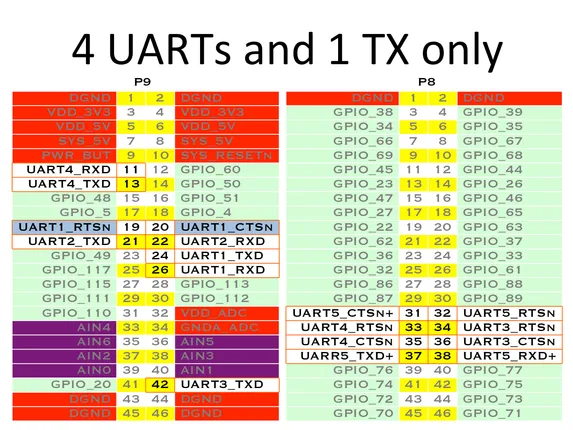](../../../../library/media/1a0980b7494ccd1d5d03f34f8db225b3f442d402aa831dd74ac3c64f760f80b2.png)

[Open original reference](../../../../library/media/1a0980b7494ccd1d5d03f34f8db225b3f442d402aa831dd74ac3c64f760f80b2.png)

**Credit and rights:** Source rights not yet established. Source/manufacturer: Seeed Studio.

Original source index: Pin Multiplexing (UART). This file is searchable but has not been promoted to a reviewed physical board pinout.

SHA-256: `1a0980b7494ccd1d5d03f34f8db225b3f442d402aa831dd74ac3c64f760f80b2`

Pin assignments have not been independently electrically verified. Check board revision before wiring.
