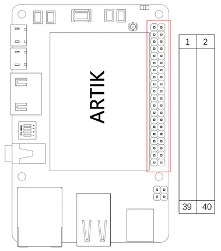
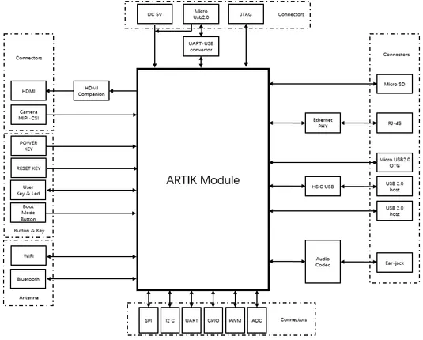
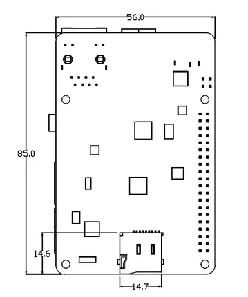
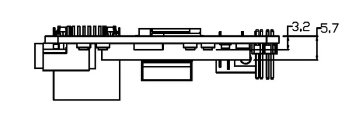
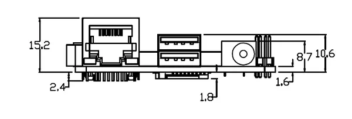
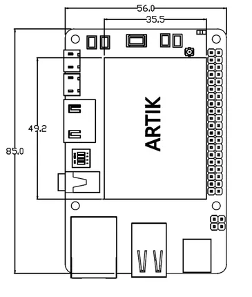
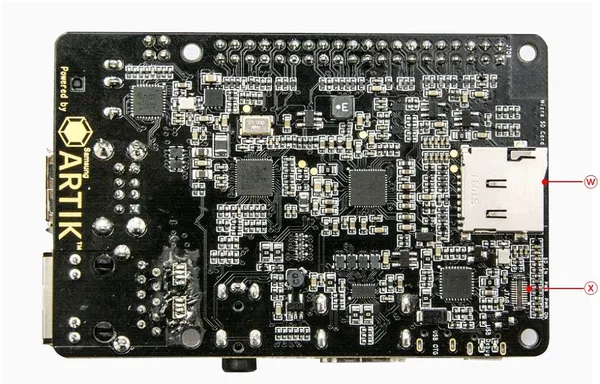
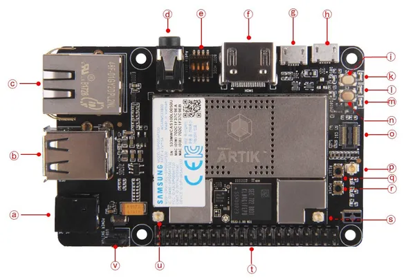

# Eagleye 530s

**Seeed Studio** · Other SBC

Revision: Not identified  
Coverage: Board labels only; pinout needed

[Browse all manufacturers](../../../../BROWSE.md) · [Desktop app](https://github.com/valleytechsolutions/black-wire-desktop)

## Pinout

**board labeling image** · Reviewed source · PNG

[Open original reference](../../../../library/media/f3dabedcec443544efee3fc51ea6c792065651ef9d8639160131c2a130a8183f.png)

**Credit and rights:** Not established; source attribution retained. Source/manufacturer: Seeed Studio.

[Source 1](https://files.seeedstudio.com/wiki/Eagleye_530s/img/pin_map.png) · [Source 2](https://wiki.seeedstudio.com/Eagleye_530s/)

Imported from existing Seeed Studio Board Reference; original working path preserved.

SHA-256: `f3dabedcec443544efee3fc51ea6c792065651ef9d8639160131c2a130a8183f`

## Block Diagram

**source reference** · Unreviewed source · PNG

[Open original reference](../../../../library/media/ce0331030e4cf466f44f2758a14a2c6b714b203e3c59cc36feb3d2c0aa04a7bd.png)

**Credit and rights:** Source rights not yet established. Source/manufacturer: Seeed Studio.

[Source 1](https://files.seeedstudio.com/wiki/Eagleye_530s/img/block_digram.png) · [Source 2](https://wiki.seeedstudio.com/Eagleye_530s/)

Original source index: Block Diagram. This file is searchable but has not been promoted to a reviewed physical board pinout.

SHA-256: `ce0331030e4cf466f44f2758a14a2c6b714b203e3c59cc36feb3d2c0aa04a7bd`

## Dimensions (Back)

**source reference** · Unreviewed source · PNG

[Open original reference](../../../../library/media/ced5f9f86f3fad5dbb154d50197be6cc5342731590bad53d2862f8d7f4fd1f3d.png)

**Credit and rights:** Source rights not yet established. Source/manufacturer: Seeed Studio.

[Source 1](https://files.seeedstudio.com/wiki/Eagleye_530s/img/MECHANICAL5.png) · [Source 2](https://wiki.seeedstudio.com/Eagleye_530s/)

Original source index: Dimensions (Back). This file is searchable but has not been promoted to a reviewed physical board pinout.

SHA-256: `ced5f9f86f3fad5dbb154d50197be6cc5342731590bad53d2862f8d7f4fd1f3d`

## Dimensions (Header Side)

**source reference** · Unreviewed source · PNG

[Open original reference](../../../../library/media/f064355fb531f3af76edc7532885330f681f9bc0493ae681663cbf9686913b68.png)

**Credit and rights:** Source rights not yet established. Source/manufacturer: Seeed Studio.

[Source 1](https://files.seeedstudio.com/wiki/Eagleye_530s/img/MECHANICAL4.png) · [Source 2](https://wiki.seeedstudio.com/Eagleye_530s/)

Original source index: Dimensions (Header Side). This file is searchable but has not been promoted to a reviewed physical board pinout.

SHA-256: `f064355fb531f3af76edc7532885330f681f9bc0493ae681663cbf9686913b68`

## Dimensions (I-O Side)

**source reference** · Unreviewed source · PNG

[Open original reference](../../../../library/media/8fcc62d0df4739fea50a891052ec7b6910133dca115cdabb0cba4626a4a6989e.png)

**Credit and rights:** Source rights not yet established. Source/manufacturer: Seeed Studio.

[Source 1](https://files.seeedstudio.com/wiki/Eagleye_530s/img/MECHANICAL2.png) · [Source 2](https://wiki.seeedstudio.com/Eagleye_530s/)

Original source index: Dimensions (I-O Side). This file is searchable but has not been promoted to a reviewed physical board pinout.

SHA-256: `8fcc62d0df4739fea50a891052ec7b6910133dca115cdabb0cba4626a4a6989e`

## Dimensions (Top)

**source reference** · Unreviewed source · PNG

[Open original reference](../../../../library/media/3401794f36233138a5300a747c5cfc959a986d0e08ff4d7f59207ea7ac7e2d3e.png)

**Credit and rights:** Source rights not yet established. Source/manufacturer: Seeed Studio.

[Source 1](https://files.seeedstudio.com/wiki/Eagleye_530s/img/MECHANICAL1.png) · [Source 2](https://wiki.seeedstudio.com/Eagleye_530s/)

Original source index: Dimensions (Top). This file is searchable but has not been promoted to a reviewed physical board pinout.

SHA-256: `3401794f36233138a5300a747c5cfc959a986d0e08ff4d7f59207ea7ac7e2d3e`

## Hardware Overview (Back)

**source reference** · Unreviewed source · JPG

[Open original reference](../../../../library/media/c20d9dbb479cf48a8fdc023fc3895700430f4cc67d9cb0901e98040164301d7b.jpg)

**Credit and rights:** Source rights not yet established. Source/manufacturer: Seeed Studio.

[Source 1](https://files.seeedstudio.com/wiki/Eagleye_530s/img/eagleye_530s_back.JPG) · [Source 2](https://wiki.seeedstudio.com/Eagleye_530s/)

Original source index: Hardware Overview (Back). This file is searchable but has not been promoted to a reviewed physical board pinout.

SHA-256: `c20d9dbb479cf48a8fdc023fc3895700430f4cc67d9cb0901e98040164301d7b`

## Hardware Overview (Front)

**source reference** · Unreviewed source · JPG

[Open original reference](../../../../library/media/782e1f605ff26f7858b8f6c3592a9ccfbe0194b4c357153235bb78ffec8b7532.jpg)

**Credit and rights:** Source rights not yet established. Source/manufacturer: Seeed Studio.

[Source 1](https://files.seeedstudio.com/wiki/Eagleye_530s/img/eagleye_530s_front.JPG) · [Source 2](https://wiki.seeedstudio.com/Eagleye_530s/)

Original source index: Hardware Overview (Front). This file is searchable but has not been promoted to a reviewed physical board pinout.

SHA-256: `782e1f605ff26f7858b8f6c3592a9ccfbe0194b4c357153235bb78ffec8b7532`

Pin assignments have not been independently electrically verified. Check board revision before wiring.
