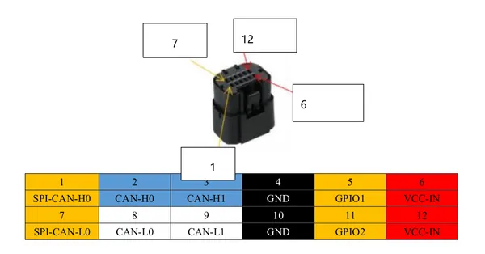
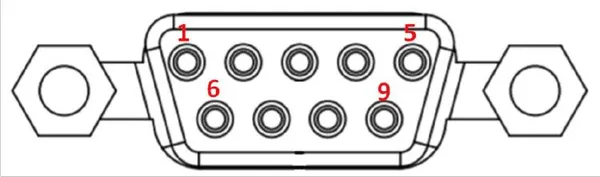
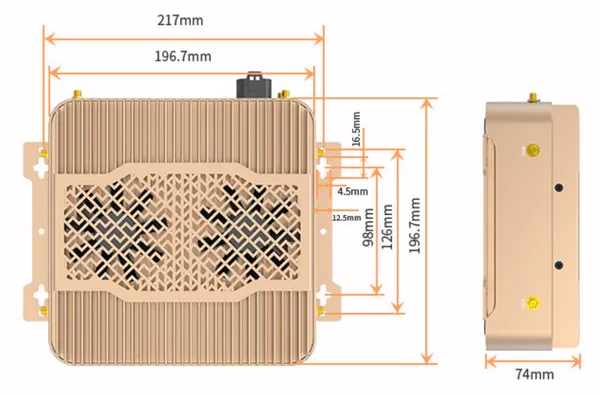
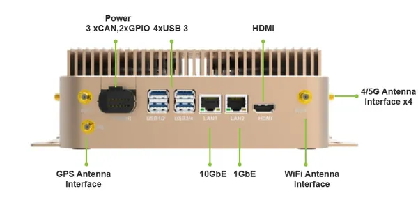
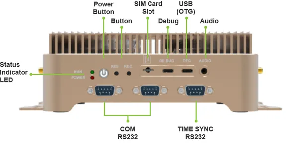
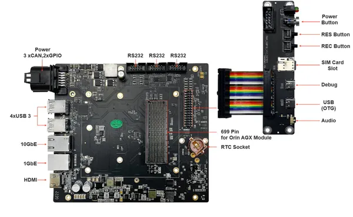
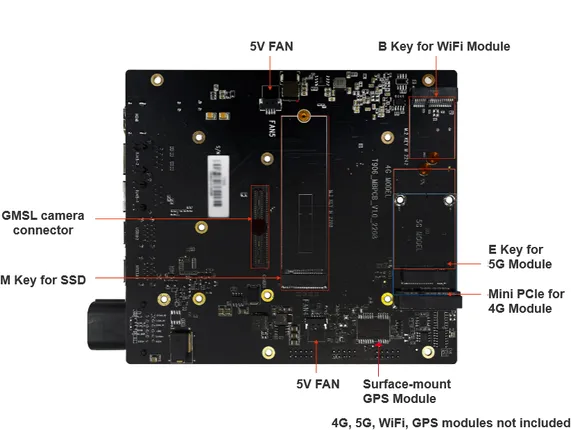
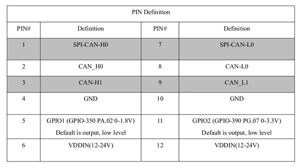
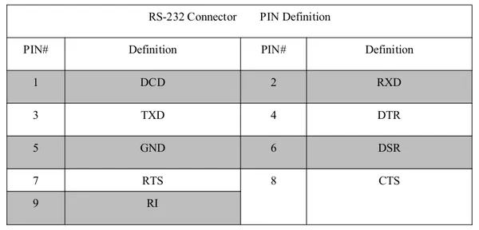

# Mini AI Computer T906

**Seeed Studio** · Other SBC

Revision: Not identified  
Coverage: Partial pinout collected; full reference still needed

[Browse all manufacturers](../../../../BROWSE.md) · [Desktop app](https://github.com/valleytechsolutions/black-wire-desktop)

## Pinout (Multifunctional Interface)

**pinout image** · Reviewed source · PNG

[Open original reference](../../../../library/media/46757f91b077f7557a886559184668811215a97f0ba692ec6fd94e9ba2a8240d.png)

**Credit and rights:** Not established; source attribution retained. Source/manufacturer: Seeed Studio.

[Source 1](https://files.seeedstudio.com/wiki/AI_Computer_T906/image/multifunc.png) · [Source 2](https://wiki.seeedstudio.com/Mini_AI_Computer_T906/)

Imported from existing Seeed Studio Board Reference; original working path preserved. Only the named connector or subsection is covered.

**Partial diagram. Confirm missing pins against the exact board documentation.**

SHA-256: `46757f91b077f7557a886559184668811215a97f0ba692ec6fd94e9ba2a8240d`

## Pinout (RS-232)

**board labeling image** · Reviewed source · PNG

[Open original reference](../../../../library/media/25f03fc47b672840221222419402a2db3ca78ae707d1e6926c3eb17dea7ecfe3.png)

**Credit and rights:** Not established; source attribution retained. Source/manufacturer: Seeed Studio.

[Source 1](https://files.seeedstudio.com/wiki/AI_Computer_T906/image/serial.png) · [Source 2](https://wiki.seeedstudio.com/Mini_AI_Computer_T906/)

Imported from existing Seeed Studio Board Reference; original working path preserved.

SHA-256: `25f03fc47b672840221222419402a2db3ca78ae707d1e6926c3eb17dea7ecfe3`

## Dimensions

**source reference** · Unreviewed source · PNG

[Open original reference](../../../../library/media/f070192a8c41e4c36c1bba4a67efd58551fb3b0f836f15603ac12a6ebd1f720d.png)

**Credit and rights:** Source rights not yet established. Source/manufacturer: Seeed Studio.

[Source 1](https://files.seeedstudio.com/wiki/AI_Computer_T906/image/dimensions.png) · [Source 2](https://wiki.seeedstudio.com/Mini_AI_Computer_T906/)

Original source index: Dimensions. This file is searchable but has not been promoted to a reviewed physical board pinout.

SHA-256: `f070192a8c41e4c36c1bba4a67efd58551fb3b0f836f15603ac12a6ebd1f720d`

## Hardware Overview (Back)

**source reference** · Unreviewed source · JPG

[Open original reference](../../../../library/media/636a7e90458797f84b6875342b0a418abbd01e7ff53ff2a19ad297cd62e1347a.jpg)

**Credit and rights:** Source rights not yet established. Source/manufacturer: Seeed Studio.

[Source 1](https://media-cdn.seeedstudio.com/media/wysiwyg/image_3.png) · [Source 2](https://wiki.seeedstudio.com/Mini_AI_Computer_T906/)

Original source index: Hardware Overview (Back). This file is searchable but has not been promoted to a reviewed physical board pinout.

SHA-256: `636a7e90458797f84b6875342b0a418abbd01e7ff53ff2a19ad297cd62e1347a`

## Hardware Overview (Front)

**source reference** · Unreviewed source · PNG

[Open original reference](../../../../library/media/d00175d1c8878541b8b4eb7d1ac35d84640b0d8123ab62260ae0d6356ec5ed9a.png)

**Credit and rights:** Source rights not yet established. Source/manufacturer: Seeed Studio.

[Source 1](https://wdcdn.qpic.cn/MTY4ODg1NTkyNTI4NTE1NA_993556_gptApDMPltVJB-Sv_1667353575?w=817&h=407) · [Source 2](https://wiki.seeedstudio.com/Mini_AI_Computer_T906/)

Original source index: Hardware Overview (Front). This file is searchable but has not been promoted to a reviewed physical board pinout.

SHA-256: `d00175d1c8878541b8b4eb7d1ac35d84640b0d8123ab62260ae0d6356ec5ed9a`

## Hardware Overview (Inside) (IO Board)

**source reference** · Unreviewed source · JPG

[Open original reference](../../../../library/media/6464c8b6994e982d7df1bef5dc5d3c235e85d9fe48027e1a903734f92ba4f8c7.jpg)

**Credit and rights:** Source rights not yet established. Source/manufacturer: Seeed Studio.

[Source 1](https://media-cdn.seeedstudio.com/media/wysiwyg/image_4.png) · [Source 2](https://wiki.seeedstudio.com/Mini_AI_Computer_T906/)

Original source index: Hardware Overview (Inside) (IO Board). This file is searchable but has not been promoted to a reviewed physical board pinout.

SHA-256: `6464c8b6994e982d7df1bef5dc5d3c235e85d9fe48027e1a903734f92ba4f8c7`

## Hardware Overview (Inside) (Main Board)

**source reference** · Unreviewed source · PNG

[Open original reference](../../../../library/media/f78200ee317fa73b3f280183885e244bf89df04095f0932fd2fe7953f2c5e68b.png)

**Credit and rights:** Source rights not yet established. Source/manufacturer: Seeed Studio.

[Source 1](https://wdcdn.qpic.cn/MTY4ODg1NTkyNTI4NTE1NA_35550_jEJeygKqw0R2wDo3_1667459768?w=823&h=620) · [Source 2](https://wiki.seeedstudio.com/Mini_AI_Computer_T906/)

Original source index: Hardware Overview (Inside) (Main Board). This file is searchable but has not been promoted to a reviewed physical board pinout.

SHA-256: `f78200ee317fa73b3f280183885e244bf89df04095f0932fd2fe7953f2c5e68b`

## Pin Definition Table (Multifunctional Interface)

**source reference** · Unreviewed source · PNG

[Open original reference](../../../../library/media/2ac4fb6986d762d367c0d94fe32c3836ee206865decefd33cb1cda3c417a6946.png)

**Credit and rights:** Source rights not yet established. Source/manufacturer: Seeed Studio.

[Source 1](https://files.seeedstudio.com/wiki/AI_Computer_T906/image/multifunc_pin.png) · [Source 2](https://wiki.seeedstudio.com/Mini_AI_Computer_T906/)

Original source index: Pin Definition Table (Multifunctional Interface). This file is searchable but has not been promoted to a reviewed physical board pinout.

SHA-256: `2ac4fb6986d762d367c0d94fe32c3836ee206865decefd33cb1cda3c417a6946`

## Pin Definition Table (RS-232)

**source reference** · Unreviewed source · PNG

[Open original reference](../../../../library/media/118b823aed5f4b6f96f4318105fddc705a65a2549658f6224fdaba41b05f769d.png)

**Credit and rights:** Source rights not yet established. Source/manufacturer: Seeed Studio.

[Source 1](https://files.seeedstudio.com/wiki/AI_Computer_T906/image/serial_pin.png) · [Source 2](https://wiki.seeedstudio.com/Mini_AI_Computer_T906/)

Original source index: Pin Definition Table (RS-232). This file is searchable but has not been promoted to a reviewed physical board pinout.

SHA-256: `118b823aed5f4b6f96f4318105fddc705a65a2549658f6224fdaba41b05f769d`

Pin assignments have not been independently electrically verified. Check board revision before wiring.
