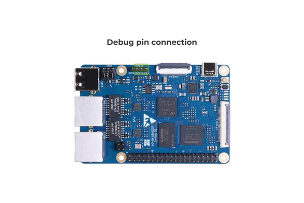

# ODYSSEY STM32MP135D

**Seeed Studio** · Other SBC

Revision: Not identified  
Coverage: Partial pinout collected; full reference still needed

[Browse all manufacturers](../../../../BROWSE.md) · [Desktop app](https://github.com/valleytechsolutions/black-wire-desktop)

## Pinout (Debug UART)

**pinout image** · Reviewed source · PNG

[Open original reference](../../../../library/media/0829bf331b0161d8c9fb223940281b77d5fa627cd6652a6f60864108a2940f3e.png)

**Credit and rights:** Not established; source attribution retained. Source/manufacturer: Seeed Studio.

[Source 1](https://wdcdn.qpic.cn/MTY4ODg1NTkyNTI4NTEyMg_558688_ff47Pijnl_CdTY5i_1689582643?w=1201&h=801&type=image/png) · [Source 2](https://wiki.seeedstudio.com/ODYSSEY-STM32MP135D/)

Imported from existing Seeed Studio Board Reference; original working path preserved. Only the named connector or subsection is covered.

**Partial diagram. Confirm missing pins against the exact board documentation.**

SHA-256: `0829bf331b0161d8c9fb223940281b77d5fa627cd6652a6f60864108a2940f3e`

Pin assignments have not been independently electrically verified. Check board revision before wiring.
