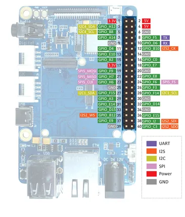
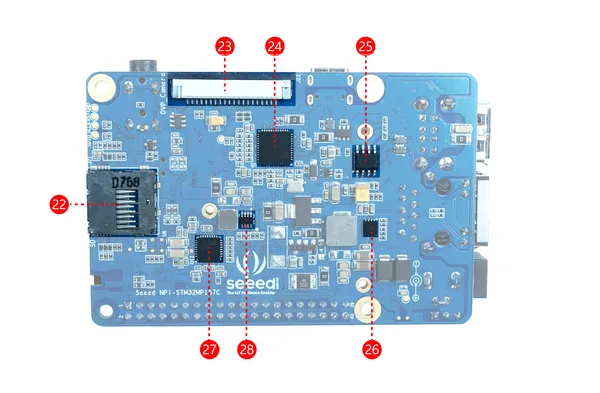
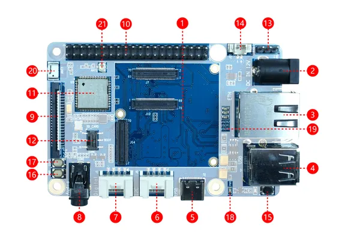

# ODYSSEY STM32MP157C

**Seeed Studio** · Other SBC

Revision: Not identified

Coverage: Pinout image collected

[Browse all manufacturers](../../../../BROWSE.md) · [Devices & IoT](../../../../DEVICES.md) · [Open in the browser guide](https://valleytech-black-wire-guide.pages.dev/?board=seeed-studio-other-sbc-odyssey-stm32mp157c)

Architecture: **ARM**

## Specifications and hardware documentation

- [Manufacturer hardware documentation](https://wiki.seeedstudio.com/ODYSSEY-STM32MP157C/)

## Pinout

**pinout image** · Reviewed source · PNG

[Open original reference](../../../../library/media/261e38a0af6f268b102e463eaba1a71cad0fcd04e7effe3bf5b6569599cc118c.png)

**Credit and rights:** Not established; source attribution retained. Source/manufacturer: Seeed Studio.

[Source 1](https://files.seeedstudio.com/wiki/ODYSSEY-STM32MP157C/IMG/GPIO.png) · [Source 2](https://wiki.seeedstudio.com/ODYSSEY-STM32MP157C/)

Imported from existing Seeed Studio Board Reference; original working path preserved.

Image revision: Not identified

SHA-256: `261e38a0af6f268b102e463eaba1a71cad0fcd04e7effe3bf5b6569599cc118c`

## Dimensions

**source reference** · Unreviewed source · PDF

[Open original reference](../../../../library/media/f0682ba8533988014b84e44665be02bd122a69a3c906ec3d5c66c027ccdb64a9.pdf)

**Credit and rights:** Source rights not yet established. Source/manufacturer: Seeed Studio.

[Source 1](https://files.seeedstudio.com/wiki/ODYSSEY-STM32MP157C/STM32-2d-file.pdf) · [Source 2](https://wiki.seeedstudio.com/ODYSSEY-STM32MP157C/)

Original source index: Dimensions. This file is searchable but has not been promoted to a reviewed physical board pinout.

Image revision: Not identified

SHA-256: `f0682ba8533988014b84e44665be02bd122a69a3c906ec3d5c66c027ccdb64a9`

## Hardware Overview (Back)

**source reference** · Unreviewed source · PNG

[Open original reference](../../../../library/media/071898127738c8702b1adb3c886311ebc00921e9d76e7c05012d389c4f3b7456.png)

**Credit and rights:** Source rights not yet established. Source/manufacturer: Seeed Studio.

[Source 1](https://files.seeedstudio.com/wiki/ODYSSEY-STM32MP157C/IMG/back.png) · [Source 2](https://wiki.seeedstudio.com/ODYSSEY-STM32MP157C/)

Original source index: Hardware Overview (Back). This file is searchable but has not been promoted to a reviewed physical board pinout.

Image revision: Not identified

SHA-256: `071898127738c8702b1adb3c886311ebc00921e9d76e7c05012d389c4f3b7456`

## Hardware Overview (Front)

**source reference** · Unreviewed source · PNG

[Open original reference](../../../../library/media/c0fda06d81ce1b9702a94eb88415470b2b1ccd739ddf51072ba6d8f33620126b.png)

**Credit and rights:** Source rights not yet established. Source/manufacturer: Seeed Studio.

[Source 1](https://files.seeedstudio.com/wiki/ODYSSEY-STM32MP157C/IMG/front.png) · [Source 2](https://wiki.seeedstudio.com/ODYSSEY-STM32MP157C/)

Original source index: Hardware Overview (Front). This file is searchable but has not been promoted to a reviewed physical board pinout.

Image revision: Not identified

SHA-256: `c0fda06d81ce1b9702a94eb88415470b2b1ccd739ddf51072ba6d8f33620126b`

Pin assignments have not been independently electrically verified. Check board revision before wiring.
