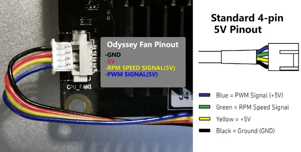
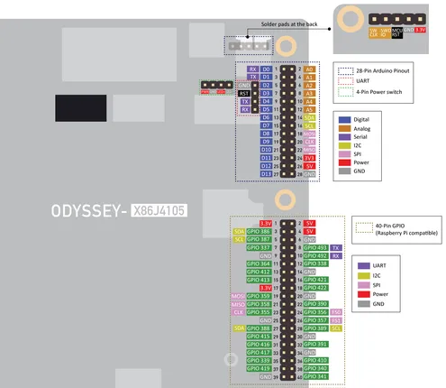
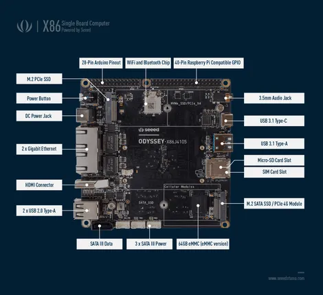

# ODYSSEY X86J4105

**Seeed Studio** · Other SBC

Revision: Not identified  
Coverage: Pinout image collected

[Browse all manufacturers](../../../../BROWSE.md) · [Desktop app](https://github.com/valleytechsolutions/black-wire-desktop)

## Pinout (Fan Header)

**pinout image** · Reviewed source · PNG

[Open original reference](../../../../library/media/b48490e196f95eeaf570014a9ee50c57b368285fa7d9e53b36dfeb5bffa357d7.png)

**Credit and rights:** Not established; source attribution retained. Source/manufacturer: Seeed Studio.

[Source 1](https://files.seeedstudio.com/wiki/ODYSSEY-X86J4105864/img/x86-fan.png) · [Source 2](https://wiki.seeedstudio.com/Fan_Pinout/)

Imported from existing Seeed Studio Board Reference; original working path preserved. Only the named connector or subsection is covered.

**Partial diagram. Confirm missing pins against the exact board documentation.**

SHA-256: `b48490e196f95eeaf570014a9ee50c57b368285fa7d9e53b36dfeb5bffa357d7`

## Pinout

**pinout image** · Reviewed source · PNG

[Open original reference](../../../../library/media/68d424a4b65f578551ed043a807373fe2dc99386e5b9904a981f29aa47996ee3.png)

**Credit and rights:** Not established; source attribution retained. Source/manufacturer: Seeed Studio.

[Source 1](https://files.seeedstudio.com/wiki/ODYSSEY-X86J4105864/img/X86-Pinout.png) · [Source 2](https://wiki.seeedstudio.com/ODYSSEY_Getting_Started/)

Imported from existing Seeed Studio Board Reference; original working path preserved.

SHA-256: `68d424a4b65f578551ed043a807373fe2dc99386e5b9904a981f29aa47996ee3`

## Dimensions

**source reference** · Unreviewed source · PDF

[Open original reference](../../../../library/media/46c9482cb30153048a5f5ad0594e18c189dc3f31e31c4f3793bd2d5ba06d17ee.pdf)

**Credit and rights:** Source rights not yet established. Source/manufacturer: Seeed Studio.

[Source 1](https://files.seeedstudio.com/wiki/ODYSSEY-X86J4105864/Documents/ODYSSEY-X86-2D.pdf) · [Source 2](https://wiki.seeedstudio.com/ODYSSEY-X86J4105/)

Original source index: Dimensions. This file is searchable but has not been promoted to a reviewed physical board pinout.

SHA-256: `46c9482cb30153048a5f5ad0594e18c189dc3f31e31c4f3793bd2d5ba06d17ee`

## Hardware Overview

**source reference** · Unreviewed source · PNG

[Open original reference](../../../../library/media/148b89930edddb05df04c04a9ba9f2beb80246df219cece6e2c9d4b216eebf62.png)

**Credit and rights:** Source rights not yet established. Source/manufacturer: Seeed Studio.

[Source 1](https://files.seeedstudio.com/wiki/ODYSSEY-X86J4105864/img/X86-08-n.png) · [Source 2](https://wiki.seeedstudio.com/ODYSSEY_Getting_Started/)

Original source index: Hardware Overview. This file is searchable but has not been promoted to a reviewed physical board pinout.

SHA-256: `148b89930edddb05df04c04a9ba9f2beb80246df219cece6e2c9d4b216eebf62`

Pin assignments have not been independently electrically verified. Check board revision before wiring.
