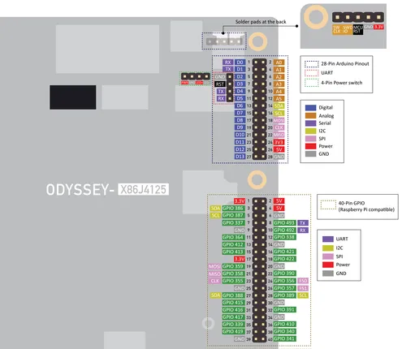
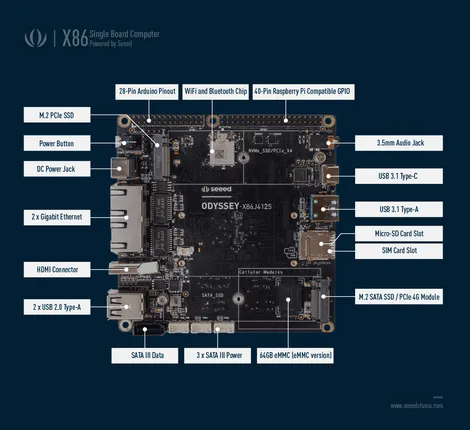

# ODYSSEY X86J4125

**Seeed Studio** · Other SBC

Revision: Not identified

Coverage: Pinout image collected

[Browse all manufacturers](../../../../BROWSE.md) · [Devices & IoT](../../../../DEVICES.md) · [Open in the browser guide](https://valleytech-black-wire-guide.pages.dev/?board=seeed-studio-other-sbc-odyssey-x86j4125)

Architecture: **x86**

## Specifications and hardware documentation

- [Manufacturer hardware documentation](https://wiki.seeedstudio.com/ODYSSEY-X86J4105/)

## Pinout

**pinout image** · Reviewed source · PNG

[Open original reference](../../../../library/media/48f10a509c2469f88b24d1b7ae1318a030a540acf09d3fbe6ff7efabf127cc93.png)

**Credit and rights:** Not established; source attribution retained. Source/manufacturer: Seeed Studio.

[Source 1](https://files.seeedstudio.com/wiki/ODYSSEY-X86J4125/pinout.png) · [Source 2](https://wiki.seeedstudio.com/ODYSSEY-X86J4105/)

Imported from existing Seeed Studio Board Reference; original working path preserved.

Image revision: Not identified

SHA-256: `48f10a509c2469f88b24d1b7ae1318a030a540acf09d3fbe6ff7efabf127cc93`

## Hardware Overview

**source reference** · Unreviewed source · PNG

[Open original reference](../../../../library/media/749624816ced7b581ad6cbde8b328ef76a77a3f5c802ff09c5754eef8dd02b79.png)

**Credit and rights:** Source rights not yet established. Source/manufacturer: Seeed Studio.

[Source 1](https://files.seeedstudio.com/wiki/ODYSSEY-X86J4125/hw_overview.png) · [Source 2](https://wiki.seeedstudio.com/ODYSSEY-X86J4105/)

Original source index: Hardware Overview. This file is searchable but has not been promoted to a reviewed physical board pinout.

Image revision: Not identified

SHA-256: `749624816ced7b581ad6cbde8b328ef76a77a3f5c802ff09c5754eef8dd02b79`

Pin assignments have not been independently electrically verified. Check board revision before wiring.
