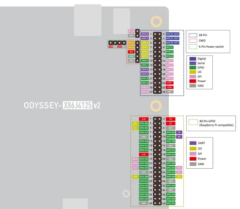
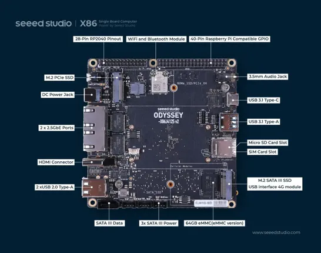

# ODYSSEY X86J4125 V2

**Seeed Studio** · Other SBC

Revision: Not identified  
Coverage: Pinout image collected

[Browse all manufacturers](../../../../BROWSE.md) · [Desktop app](https://github.com/valleytechsolutions/black-wire-desktop)

## Pinout

**pinout image** · Reviewed source · JPG

[Open original reference](../../../../library/media/ff256f1de07b87088be1e1a6fd085013a42f9af1d21b9c4d6d5ca8eee17ebbff.jpg)

**Credit and rights:** Not established; source attribution retained. Source/manufacturer: Seeed Studio.

[Source 1](https://files.seeedstudio.com/wiki/ODYSSEY-X86J4105864/img/x86J4125v2.jpg) · [Source 2](https://wiki.seeedstudio.com/ODYSSEY-X86J4105/)

Imported from existing Seeed Studio Board Reference; original working path preserved.

SHA-256: `ff256f1de07b87088be1e1a6fd085013a42f9af1d21b9c4d6d5ca8eee17ebbff`

## Hardware Overview

**source reference** · Unreviewed source · JPG

[Open original reference](../../../../library/media/0e72008522f7b2761784234671ad730a756dcfa8996ea21602a8d43efe8d8bff.jpg)

**Credit and rights:** Source rights not yet established. Source/manufacturer: Seeed Studio.

[Source 1](https://files.seeedstudio.com/wiki/ODYSSEY_X86J4125_v2/hw_overview.jpg) · [Source 2](https://wiki.seeedstudio.com/ODYSSEY-X86J4105/)

Original source index: Hardware Overview. This file is searchable but has not been promoted to a reviewed physical board pinout.

SHA-256: `0e72008522f7b2761784234671ad730a756dcfa8996ea21602a8d43efe8d8bff`

Pin assignments have not been independently electrically verified. Check board revision before wiring.
