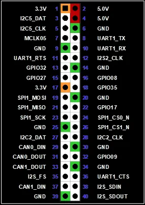
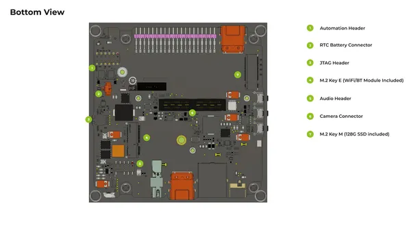
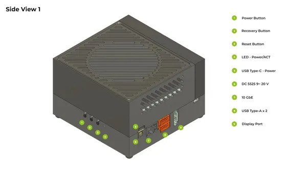
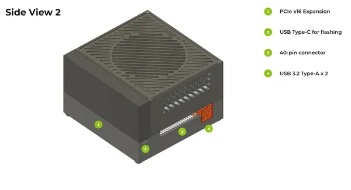

# reComputer Classic J501

**Seeed Studio** · Other SBC

Revision: Not identified

Coverage: Partial pinout collected; full reference still needed

[Browse all manufacturers](../../../../BROWSE.md) · [Devices & IoT](../../../../DEVICES.md) · [Open in the browser guide](https://valleytech-black-wire-guide.pages.dev/?board=seeed-studio-other-sbc-recomputer-classic-j501)

Architecture: **ARM**

## Specifications and hardware documentation

- [Manufacturer hardware documentation](https://wiki.seeedstudio.com/ai_robotics_seeed_agx_orin_dev_kit_getting_started/)

## Pinout

**pinout image** · Reviewed source · PNG

[Open original reference](../../../../library/media/d91b1758f25e276248c45a580f4e2b139a7d0d93bb6750ec0f10fcc692c24336.png)

**Credit and rights:** Not established; source attribution retained. Source/manufacturer: Seeed Studio.

[Source 1](https://files.seeedstudio.com/wiki/reComputer-Jetson/Classic_J501/interface_40pin_header_pinout.png) · [Source 2](https://wiki.seeedstudio.com/ai_robotics_seeed_agx_orin_dev_kit_getting_started/)

Imported from existing Seeed Studio Board Reference; original working path preserved. Only the named connector or subsection is covered. Official J501 documentation warns that some diagram signal labels differ from the datasheet J30 table (including I2C bus naming). Preserve the original image; consult the linked datasheet for authoritative signal names.

Image revision: Not identified

SHA-256: `d91b1758f25e276248c45a580f4e2b139a7d0d93bb6750ec0f10fcc692c24336`

## Hardware Overview (Bottom)

**source reference** · Unreviewed source · PNG

[Open original reference](../../../../library/media/9054910957d066c284ba1a24c2c432f9cdcee99384c68684116aed71cac2a56d.png)

**Credit and rights:** Source rights not yet established. Source/manufacturer: Seeed Studio.

Original source index: Hardware Overview (Bottom). This file is searchable but has not been promoted to a reviewed physical board pinout.

Image revision: Not identified

SHA-256: `9054910957d066c284ba1a24c2c432f9cdcee99384c68684116aed71cac2a56d`

## Hardware Overview (Side) (1)

**source reference** · Unreviewed source · PNG

[Open original reference](../../../../library/media/0f6a3be5cefcac0b3d71a3c345f3629681d28e9e742977ee5172295cbb271f23.png)

**Credit and rights:** Source rights not yet established. Source/manufacturer: Seeed Studio.

Original source index: Hardware Overview (Side) (1). This file is searchable but has not been promoted to a reviewed physical board pinout.

Image revision: Not identified

SHA-256: `0f6a3be5cefcac0b3d71a3c345f3629681d28e9e742977ee5172295cbb271f23`

## Hardware Overview (Side) (2)

**source reference** · Unreviewed source · PNG

[Open original reference](../../../../library/media/0bd42880efe06b8d1ed99085d81334cb53d22e784c5fd026cb212cf5644ef2d7.png)

**Credit and rights:** Source rights not yet established. Source/manufacturer: Seeed Studio.

Original source index: Hardware Overview (Side) (2). This file is searchable but has not been promoted to a reviewed physical board pinout.

Image revision: Not identified

SHA-256: `0bd42880efe06b8d1ed99085d81334cb53d22e784c5fd026cb212cf5644ef2d7`

Pin assignments have not been independently electrically verified. Check board revision before wiring.
