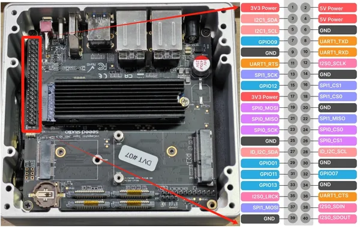
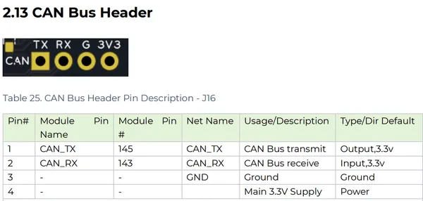
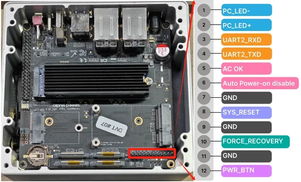

# reComputer Super J3010

**Seeed Studio** · Other SBC

Revision: Not identified  
Coverage: Pinout image collected

[Browse all manufacturers](../../../../BROWSE.md) · [Desktop app](https://github.com/valleytechsolutions/black-wire-desktop)

## Pinout

**pinout image** · Reviewed source · JPG

[Open original reference](../../../../library/media/8d1949269e64669c179b517e677656df7843d19466f04def45a7067ba6ae66ab.jpg)

**Credit and rights:** Not established; source attribution retained. Source/manufacturer: Seeed Studio.

[Source 1](https://files.seeedstudio.com/wiki/reComputer-Jetson/reComputer-super/40pin3.jpg) · [Source 2](https://wiki.seeedstudio.com/recomputer_jetson_super_hardware_interfaces_usage/)

Imported from existing Seeed Studio Board Reference; original working path preserved.

SHA-256: `8d1949269e64669c179b517e677656df7843d19466f04def45a7067ba6ae66ab`

## Pin Definition Table (CAN Bus Header)

**source reference** · Unreviewed source · PNG

[Open original reference](../../../../library/media/4e2d734f1cd5c660e8f0d8e373def7e9f09c83eeeb4917293b60ee260958c1ac.png)

**Credit and rights:** Source rights not yet established. Source/manufacturer: Seeed Studio.

[Source 1](https://files.seeedstudio.com/wiki/reComputer-Jetson/reComputer-super/can_port.png) · [Source 2](https://wiki.seeedstudio.com/recomputer_jetson_super_hardware_interfaces_usage/)

Original source index: Pin Definition Table (CAN Bus Header). This file is searchable but has not been promoted to a reviewed physical board pinout.

SHA-256: `4e2d734f1cd5c660e8f0d8e373def7e9f09c83eeeb4917293b60ee260958c1ac`

## Pin Functions (12-Pin Header)

**source reference** · Unreviewed source · JPG

[Open original reference](../../../../library/media/ea5aff5f9eb19871aec4192b86044dbc38090e52844d7b1842081d9adc245920.jpg)

**Credit and rights:** Source rights not yet established. Source/manufacturer: Seeed Studio.

Original source index: Pin Functions (12-Pin Header). This file is searchable but has not been promoted to a reviewed physical board pinout.

SHA-256: `ea5aff5f9eb19871aec4192b86044dbc38090e52844d7b1842081d9adc245920`

Pin assignments have not been independently electrically verified. Check board revision before wiring.
