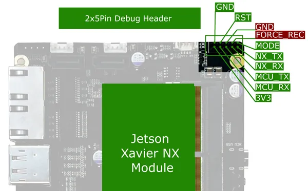
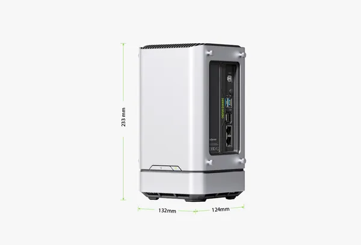
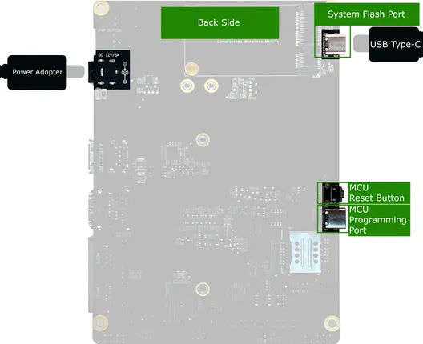
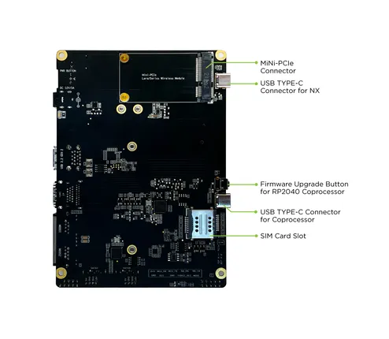
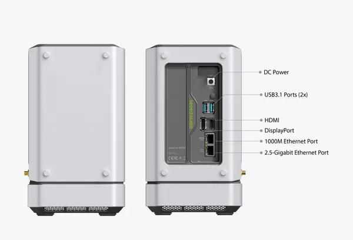
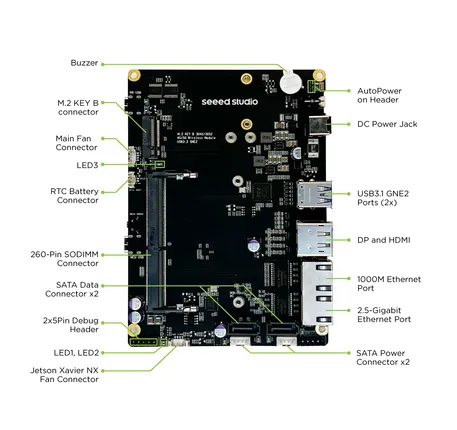

# reServer J2032

**Seeed Studio** · Other SBC

Revision: Not identified  
Coverage: Partial pinout collected; full reference still needed

[Browse all manufacturers](../../../../BROWSE.md) · [Desktop app](https://github.com/valleytechsolutions/black-wire-desktop)

## Pinout (Debug Header)

**pinout image** · Reviewed source · PNG

[Open original reference](../../../../library/media/a2806e8c174868c58190f058d1d7316a2b53574e1ab069580d4f81ee7f1f7bd8.png)

**Credit and rights:** Not established; source attribution retained. Source/manufacturer: Seeed Studio.

[Source 1](https://files.seeedstudio.com/wiki/reServerJ2032/debugheader_REC.png) · [Source 2](https://wiki.seeedstudio.com/reServer_J2032_Flash_Jetpack/)

Imported from existing Seeed Studio Board Reference; original working path preserved. Only the named connector or subsection is covered.

**Partial diagram. Confirm missing pins against the exact board documentation.**

SHA-256: `a2806e8c174868c58190f058d1d7316a2b53574e1ab069580d4f81ee7f1f7bd8`

## Dimensions

**source reference** · Unreviewed source · JPG

[Open original reference](../../../../library/media/183d98c73b832bd45ac2045cd8f48f17d3d307d2d23ac0b659a1b6bc2e0cac06.jpg)

**Credit and rights:** Source rights not yet established. Source/manufacturer: Seeed Studio.

[Source 1](https://files.seeedstudio.com/wiki/reServer/reserverpm2.jpg) · [Source 2](https://wiki.seeedstudio.com/reServer_J2032_Getting_Started/)

Original source index: Dimensions. This file is searchable but has not been promoted to a reviewed physical board pinout.

SHA-256: `183d98c73b832bd45ac2045cd8f48f17d3d307d2d23ac0b659a1b6bc2e0cac06`

## Hardware Overview (Back)

**source reference** · Unreviewed source · PNG

[Open original reference](../../../../library/media/4489897b84a0a2d775ac5f8542d47f2dc405d38a11874ac58302236196490e8b.png)

**Credit and rights:** Source rights not yet established. Source/manufacturer: Seeed Studio.

[Source 1](https://files.seeedstudio.com/wiki/reServerJ2032/back_type_c.png) · [Source 2](https://wiki.seeedstudio.com/reServer_J2032_Flash_Jetpack/)

Original source index: Hardware Overview (Back). This file is searchable but has not been promoted to a reviewed physical board pinout.

SHA-256: `4489897b84a0a2d775ac5f8542d47f2dc405d38a11874ac58302236196490e8b`

## Hardware Overview (Coprocessor Board)

**source reference** · Unreviewed source · PNG

[Open original reference](../../../../library/media/1f586db29d23984b45d3635a65097ec31a25f407b44ba5c3235b9eaaa5e4ef05.png)

**Credit and rights:** Source rights not yet established. Source/manufacturer: Seeed Studio.

[Source 1](https://files.seeedstudio.com/wiki/reComputer/reComputerJ2032hardware2.png) · [Source 2](https://wiki.seeedstudio.com/reServer_J2032_Flash_Jetpack/)

Original source index: Hardware Overview (Coprocessor Board). This file is searchable but has not been promoted to a reviewed physical board pinout.

SHA-256: `1f586db29d23984b45d3635a65097ec31a25f407b44ba5c3235b9eaaa5e4ef05`

## Hardware Overview (Ports)

**source reference** · Unreviewed source · PNG

[Open original reference](../../../../library/media/c75717ed9f21863e290c8e2c63697a866c22be85f60b78aa026806873553d1b3.png)

**Credit and rights:** Source rights not yet established. Source/manufacturer: Seeed Studio.

[Source 1](https://files.seeedstudio.com/wiki/reComputer/reComputerJ2032hardware.png) · [Source 2](https://wiki.seeedstudio.com/reServer_J2032_Getting_Started/)

Original source index: Hardware Overview (Ports). This file is searchable but has not been promoted to a reviewed physical board pinout.

SHA-256: `c75717ed9f21863e290c8e2c63697a866c22be85f60b78aa026806873553d1b3`

## Hardware Overview

**source reference** · Unreviewed source · PNG

[Open original reference](../../../../library/media/969eafdf617e42e3aea09fe4779b4e69bdcb967f0dbbfa4af635468612df1721.png)

**Credit and rights:** Source rights not yet established. Source/manufacturer: Seeed Studio.

[Source 1](https://files.seeedstudio.com/wiki/reComputer/reComputerJ2032hardware1.png) · [Source 2](https://wiki.seeedstudio.com/reServer_J2032_Flash_Jetpack/)

Original source index: Hardware Overview. This file is searchable but has not been promoted to a reviewed physical board pinout.

SHA-256: `969eafdf617e42e3aea09fe4779b4e69bdcb967f0dbbfa4af635468612df1721`

Pin assignments have not been independently electrically verified. Check board revision before wiring.
