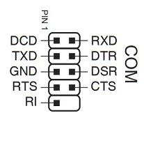
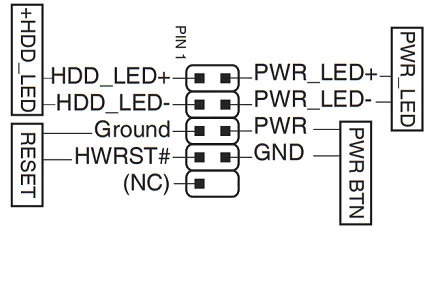
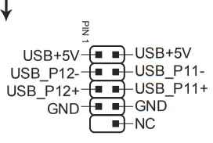
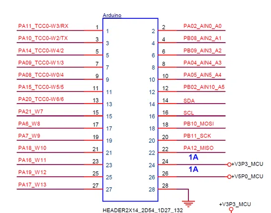
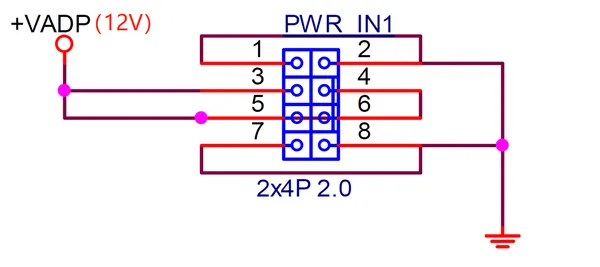
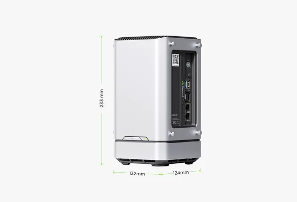
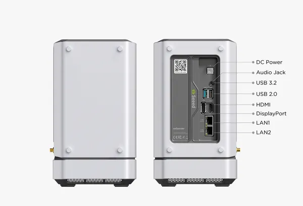
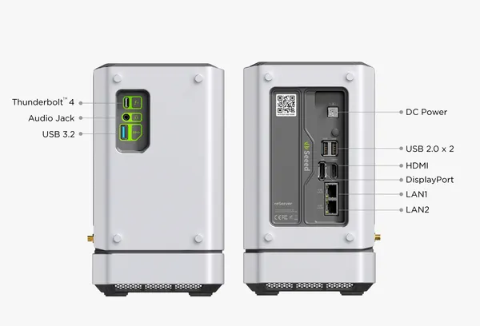
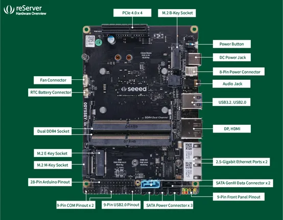

# reServer X86

**Seeed Studio** · Other SBC

Revision: Not identified

Coverage: Partial pinout collected; full reference still needed

[Browse all manufacturers](../../../../BROWSE.md) · [Devices & IoT](../../../../DEVICES.md) · [Open in the browser guide](https://valleytech-black-wire-guide.pages.dev/?board=seeed-studio-other-sbc-reserver-x86)

Architecture: **x86**

## Specifications and hardware documentation

- [Manufacturer hardware documentation](https://wiki.seeedstudio.com/reServer-Getting-Started/)

## Pinout (9-Pin COM)

**pinout image** · Reviewed source · PNG

[Open original reference](../../../../library/media/0bea22d6a5a96b07f98f8e2226757fb20cbf04417318dda208657ef587bbd775.png)

**Credit and rights:** Not established; source attribution retained. Source/manufacturer: Seeed Studio.

[Source 1](https://files.seeedstudio.com/wiki/reServer/wiki/9P_COM_pinout.png) · [Source 2](https://wiki.seeedstudio.com/reServer-Getting-Started/)

Imported from existing Seeed Studio Board Reference; original working path preserved. Only the named connector or subsection is covered.

Image revision: Not identified

SHA-256: `0bea22d6a5a96b07f98f8e2226757fb20cbf04417318dda208657ef587bbd775`

## Pinout (9-Pin Front Panel)

**pinout image** · Reviewed source · PNG

[Open original reference](../../../../library/media/63ba9a9249a903cf9f266cf9a7c69a03f12878a2f324832b7ff55d9ad5257ee8.png)

**Credit and rights:** Not established; source attribution retained. Source/manufacturer: Seeed Studio.

[Source 1](https://files.seeedstudio.com/wiki/reServer/wiki/9P_front_panel_pinout.png) · [Source 2](https://wiki.seeedstudio.com/reServer-Getting-Started/)

Imported from existing Seeed Studio Board Reference; original working path preserved. Only the named connector or subsection is covered.

Image revision: Not identified

SHA-256: `63ba9a9249a903cf9f266cf9a7c69a03f12878a2f324832b7ff55d9ad5257ee8`

## Pinout (9-Pin USB2.0)

**pinout image** · Reviewed source · PNG

[Open original reference](../../../../library/media/1e7bf8f51f0ee2fa754789eaee733aaf2ab28faf8db36d3704fed77a7a025bc0.png)

**Credit and rights:** Not established; source attribution retained. Source/manufacturer: Seeed Studio.

[Source 1](https://files.seeedstudio.com/wiki/reServer/wiki/9P_USB2.0_pinout.png) · [Source 2](https://wiki.seeedstudio.com/reServer-Getting-Started/)

Imported from existing Seeed Studio Board Reference; original working path preserved. Only the named connector or subsection is covered.

Image revision: Not identified

SHA-256: `1e7bf8f51f0ee2fa754789eaee733aaf2ab28faf8db36d3704fed77a7a025bc0`

## Pinout (28-Pin Arduino)

**GPIO reference image** · Reviewed source · PNG

[Open original reference](../../../../library/media/8dc90fcc93b9df275fb1cf943b41a526c636ad3e492af10c916332211634acb2.png)

**Credit and rights:** Not established; source attribution retained. Source/manufacturer: Seeed Studio.

[Source 1](https://files.seeedstudio.com/wiki/reServer/wiki/28P_arduino.png) · [Source 2](https://wiki.seeedstudio.com/reServer-Getting-Started/)

Imported from existing Seeed Studio Board Reference; original working path preserved.

Image revision: Not identified

SHA-256: `8dc90fcc93b9df275fb1cf943b41a526c636ad3e492af10c916332211634acb2`

## Pinout (8-Pin Power Connector)

**GPIO reference image** · Reviewed source · PNG

[Open original reference](../../../../library/media/723a70d25dd95bdd27e8c3e9dde7fa1bd255dcf144d8b901c77c3fdefe1192fa.png)

**Credit and rights:** Not established; source attribution retained. Source/manufacturer: Seeed Studio.

[Source 1](https://files.seeedstudio.com/wiki/reServer/wiki/8P_power_connector.png) · [Source 2](https://wiki.seeedstudio.com/reServer-Getting-Started/)

Imported from existing Seeed Studio Board Reference; original working path preserved.

Image revision: Not identified

SHA-256: `723a70d25dd95bdd27e8c3e9dde7fa1bd255dcf144d8b901c77c3fdefe1192fa`

## Dimensions

**source reference** · Unreviewed source · PNG

[Open original reference](../../../../library/media/606052e9eb197f7101564eaf92ad03f721fb5be92c76508f248735648b3b16de.png)

**Credit and rights:** Source rights not yet established. Source/manufacturer: Seeed Studio.

[Source 1](https://files.seeedstudio.com/products/102110559/10-%E4%BD%8E%E9%85%8D.png) · [Source 2](https://wiki.seeedstudio.com/reServer-Getting-Started/)

Original source index: Dimensions. This file is searchable but has not been promoted to a reviewed physical board pinout.

Image revision: Not identified

SHA-256: `606052e9eb197f7101564eaf92ad03f721fb5be92c76508f248735648b3b16de`

## Hardware Overview (Ports, Basic Version)

**source reference** · Unreviewed source · PNG

[Open original reference](../../../../library/media/12c6ebf4b45f94ccaa04cdbe26af1e7fa9eaa9d584b8b0a8ab4c46121541b1a2.png)

**Credit and rights:** Source rights not yet established. Source/manufacturer: Seeed Studio.

[Source 1](https://files.seeedstudio.com/products/102110559/09%20%E4%BD%8E%E9%85%8D.png) · [Source 2](https://wiki.seeedstudio.com/reServer-Getting-Started/)

Original source index: Hardware Overview (Ports, Basic Version). This file is searchable but has not been promoted to a reviewed physical board pinout.

Image revision: Not identified

SHA-256: `12c6ebf4b45f94ccaa04cdbe26af1e7fa9eaa9d584b8b0a8ab4c46121541b1a2`

## Hardware Overview (Ports, High Performance Version)

**source reference** · Unreviewed source · PNG

[Open original reference](../../../../library/media/a4e7b7b25caa88125e8c1f1a10ed9eab4c0411e211bbd99d3df59362d949b2ca.png)

**Credit and rights:** Source rights not yet established. Source/manufacturer: Seeed Studio.

[Source 1](https://files.seeedstudio.com/products/102110559/09-%E9%AB%98%E9%85%8D.png) · [Source 2](https://wiki.seeedstudio.com/reServer-Getting-Started/)

Original source index: Hardware Overview (Ports, High Performance Version). This file is searchable but has not been promoted to a reviewed physical board pinout.

Image revision: Not identified

SHA-256: `a4e7b7b25caa88125e8c1f1a10ed9eab4c0411e211bbd99d3df59362d949b2ca`

## Hardware Overview

**source reference** · Unreviewed source · PNG

[Open original reference](../../../../library/media/b29af82264137e6f3a73aa441184866c34145f9ace611c92127b8fec0a0f6dba.png)

**Credit and rights:** Source rights not yet established. Source/manufacturer: Seeed Studio.

[Source 1](https://files.seeedstudio.com/wiki/reServer/wiki/reServer%20mainboard%20.png) · [Source 2](https://wiki.seeedstudio.com/reServer-Getting-Started/)

Original source index: Hardware Overview. This file is searchable but has not been promoted to a reviewed physical board pinout.

Image revision: Not identified

SHA-256: `b29af82264137e6f3a73aa441184866c34145f9ace611c92127b8fec0a0f6dba`

Pin assignments have not been independently electrically verified. Check board revision before wiring.
