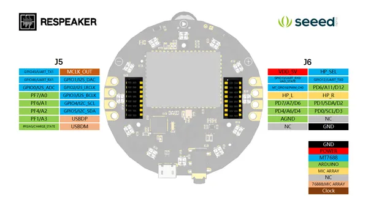
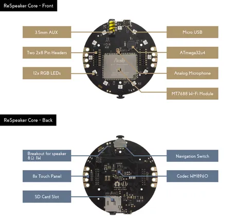

# reSpeaker Core

**Seeed Studio** · Other SBC

Revision: Not identified  
Coverage: Pinout image collected

[Browse all manufacturers](../../../../BROWSE.md) · [Devices & IoT](../../../../DEVICES.md) · [Open in the browser guide](https://valleytech-black-wire-guide.pages.dev/?board=seeed-studio-other-sbc-respeaker-core)

Device category: **Cameras & audio**

## Pinout

**pinout image** · Reviewed source · PNG

[Open original reference](../../../../library/media/b300ceddfa3df6632253227de62c93d9b9a45f05d0e309e812de24f174a3360c.png)

**Credit and rights:** Not established; source attribution retained. Source/manufacturer: Seeed Studio.

[Source 1](https://files.seeedstudio.com/wiki/Respeaker_Core/img/respeaker_core_pinmap.png) · [Source 2](https://wiki.seeedstudio.com/ReSpeaker_Core/)

Imported from existing Seeed Studio Board Reference; original working path preserved.

Image revision: Not identified

SHA-256: `b300ceddfa3df6632253227de62c93d9b9a45f05d0e309e812de24f174a3360c`

## Hardware Overview

**source reference** · Unreviewed source · JPG

[Open original reference](../../../../library/media/6ad5ad09129ec863fac4a59c6f8c26602f9ab737958b0a8cd46fd9cf9b76c9b6.jpg)

**Credit and rights:** Source rights not yet established. Source/manufacturer: Seeed Studio.

[Source 1](https://files.seeedstudio.com/wiki/Respeaker_Core/img/respeaker_core_hardware%20overview.jpg) · [Source 2](https://wiki.seeedstudio.com/ReSpeaker_Core/)

Original source index: Hardware Overview. This file is searchable but has not been promoted to a reviewed physical board pinout.

Image revision: Not identified

SHA-256: `6ad5ad09129ec863fac4a59c6f8c26602f9ab737958b0a8cd46fd9cf9b76c9b6`

Pin assignments have not been independently electrically verified. Check board revision before wiring.
