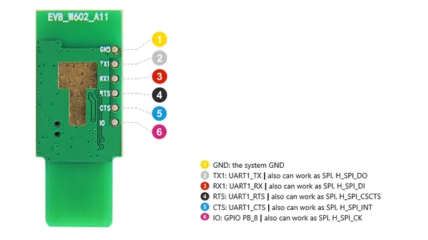
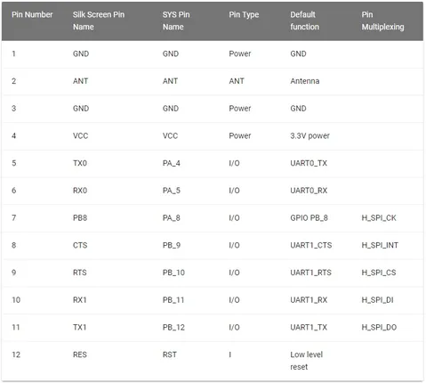
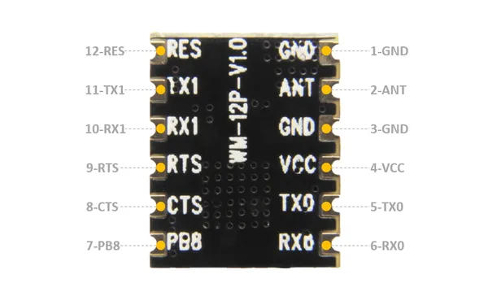

# Air602 WiFi Development Board

**Seeed Studio** · Other

Revision: Not identified  
Coverage: Pinout image collected

[Browse all manufacturers](../../../../BROWSE.md) · [Desktop app](https://github.com/valleytechsolutions/black-wire-desktop)

## Pinout (Board Header)

**pinout image** · Reviewed source · JPG

[Open original reference](../../../../library/media/cc7fb932e91c019f1a21c96706f4861bb8b428975ce9e3f5b1911e94762a0aa9.jpg)

**Credit and rights:** Not established; source attribution retained. Source/manufacturer: Seeed Studio.

[Source 1](https://files.seeedstudio.com/wiki/Bazaar_file/113990576/PIN_MAP_B.jpg) · [Source 2](https://wiki.seeedstudio.com/Air602_WiFi_Development_Board/)

Imported from existing Seeed Studio Board Reference; original working path preserved.

SHA-256: `cc7fb932e91c019f1a21c96706f4861bb8b428975ce9e3f5b1911e94762a0aa9`

## Pin Definition Table

**source reference** · Unreviewed source · JPG

[Open original reference](../../../../library/media/9decd9b255e3b713c592b8b2463aacce14512eb158931b1e368aa8bde253c765.jpg)

**Credit and rights:** Source rights not yet established. Source/manufacturer: Seeed Studio.

[Source 1](https://files.seeedstudio.com/wiki/Bazaar_file/113990576/PIN_table.jpg) · [Source 2](https://wiki.seeedstudio.com/Air602_WiFi_Development_Board/)

Original source index: Pin Definition Table. This file is searchable but has not been promoted to a reviewed physical board pinout.

SHA-256: `9decd9b255e3b713c592b8b2463aacce14512eb158931b1e368aa8bde253c765`

## Pinout

**source reference** · Unreviewed source · JPG

[Open original reference](../../../../library/media/8188578cefcffae269af41931e1cab9cceebcd540a1e8732082eeab5a5b49d38.jpg)

**Credit and rights:** Source rights not yet established. Source/manufacturer: Seeed Studio.

[Source 1](https://files.seeedstudio.com/wiki/Bazaar_file/113990576/PIN_MAP.jpg) · [Source 2](https://wiki.seeedstudio.com/Air602_WiFi_Development_Board/)

Original source index: Pinout. This file is searchable but has not been promoted to a reviewed physical board pinout.

SHA-256: `8188578cefcffae269af41931e1cab9cceebcd540a1e8732082eeab5a5b49d38`

Pin assignments have not been independently electrically verified. Check board revision before wiring.
