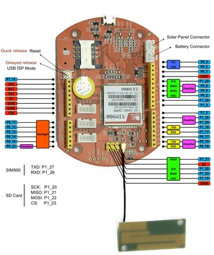

# Arch GPRS V2

**Seeed Studio** · Other

Revision: Not identified  
Coverage: Pinout image collected

[Browse all manufacturers](../../../../BROWSE.md) · [Desktop app](https://github.com/valleytechsolutions/black-wire-desktop)

## Pinout

**pinout image** · Reviewed source · PNG

[Open original reference](../../../../library/media/53b16b9b830284fb175c841915703871bac8ca901187ccd85b3faaf2b9e2b5be.png)

**Credit and rights:** Not established; source attribution retained. Source/manufacturer: Seeed Studio.

[Source 1](https://files.seeedstudio.com/wiki/Arch_GPRS_V2/img/Arch_GPRS_V2_Pinout.png) · [Source 2](https://wiki.seeedstudio.com/Arch_GPRS_V2/)

Imported from existing Seeed Studio Board Reference; original working path preserved.

SHA-256: `53b16b9b830284fb175c841915703871bac8ca901187ccd85b3faaf2b9e2b5be`

Pin assignments have not been independently electrically verified. Check board revision before wiring.
