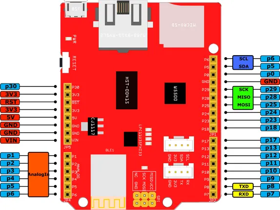

# Arch Link

**Seeed Studio** · Other

Revision: Not identified  
Coverage: Pinout image collected

[Browse all manufacturers](../../../../BROWSE.md) · [Desktop app](https://github.com/valleytechsolutions/black-wire-desktop)

## Pinout

**pinout image** · Reviewed source · PNG

[Open original reference](../../../../library/media/e3252e9ba1cebdcf8ace05e51d653a0bc2017dec6c8c69a11f7bb9bd2a079f2a.png)

**Credit and rights:** Not established; source attribution retained. Source/manufacturer: Seeed Studio.

[Source 1](https://files.seeedstudio.com/wiki/Arch_Link/img/Arch_link_pinout.png) · [Source 2](https://wiki.seeedstudio.com/Arch_Link/)

Imported from existing Seeed Studio Board Reference; original working path preserved.

SHA-256: `e3252e9ba1cebdcf8ace05e51d653a0bc2017dec6c8c69a11f7bb9bd2a079f2a`

Pin assignments have not been independently electrically verified. Check board revision before wiring.
