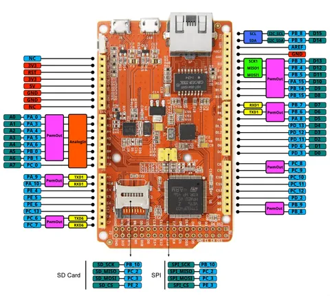

# Arch Max

**Seeed Studio** · Other

Revision: Not identified  
Coverage: Pinout image collected

[Browse all manufacturers](../../../../BROWSE.md) · [Desktop app](https://github.com/valleytechsolutions/black-wire-desktop)

## Pinout

**pinout image** · Reviewed source · PNG

[Open original reference](../../../../library/media/0338b3d56bd01d30715684648bf55739598ee12cb4511acf1f82dfe9c0335cba.png)

**Credit and rights:** Not established; source attribution retained. Source/manufacturer: Seeed Studio.

[Source 1](https://files.seeedstudio.com/wiki/Arch_Max/img/Arch_Max_Pinout.png) · [Source 2](https://wiki.seeedstudio.com/Arch_Max/)

Imported from existing Seeed Studio Board Reference; original working path preserved.

SHA-256: `0338b3d56bd01d30715684648bf55739598ee12cb4511acf1f82dfe9c0335cba`

Pin assignments have not been independently electrically verified. Check board revision before wiring.
