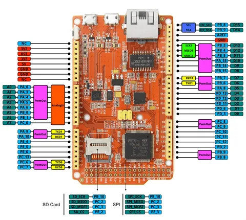

# Arch Max V1.1

**Seeed Studio** · Other

Revision: Not identified  
Coverage: Pinout image collected

[Browse all manufacturers](../../../../BROWSE.md) · [Desktop app](https://github.com/valleytechsolutions/black-wire-desktop)

## Pinout

**pinout image** · Reviewed source · PNG

[Open original reference](../../../../library/media/a8ddafe05168953edbad322efc01da795ff36bc62ea26da52097b18e4eaba8ee.png)

**Credit and rights:** Not established; source attribution retained. Source/manufacturer: Seeed Studio.

[Source 1](https://files.seeedstudio.com/wiki/Arch_Max_v1.1/img/Arch_Max_Pinout.png) · [Source 2](https://wiki.seeedstudio.com/Arch_Max_v1.1/)

Imported from existing Seeed Studio Board Reference; original working path preserved.

SHA-256: `a8ddafe05168953edbad322efc01da795ff36bc62ea26da52097b18e4eaba8ee`

Pin assignments have not been independently electrically verified. Check board revision before wiring.
